## 1. 并行计算概述

通信可能限制性能。
任务分配不均可能限制性能。

并行计算思维：
    - 分解任务成多个可并行执行的部分
    - 分配任务到多个处理器
    - 确保任务之间的通信和同步

超标量执行是指处理器在单个时钟周期内能够同时发射并执行多条指令的能力。
超标量执行是一种指令级并行性（ILP）​，发生在单个处理器核心内部。

大多数 ILP 都是基于每周期发射 4 条指令的处理器，8 路或 16 路则会边际收益递减。
因为经常会存在数据依赖，导致某些指令无法发射。

频率提升受限（功耗墙） + ILP 提升受限 -> 多核

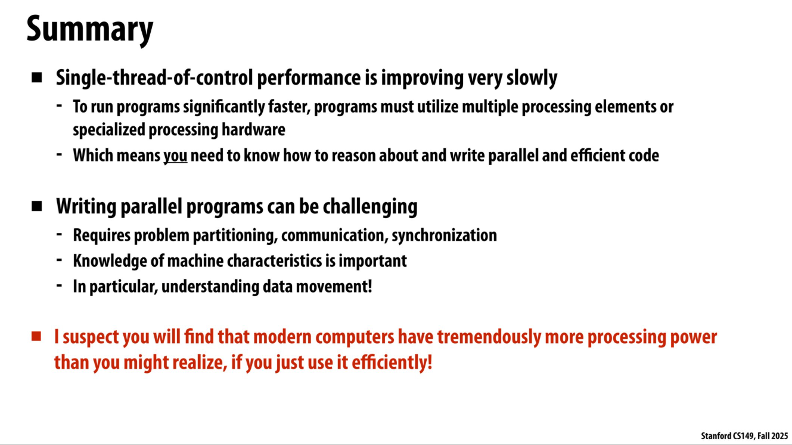

## 2. 现代多核架构（上）

> 在多核时代之前，单核处理器的设计哲学：芯片上绝大多数晶体管被用来加速单条指令流的执行。

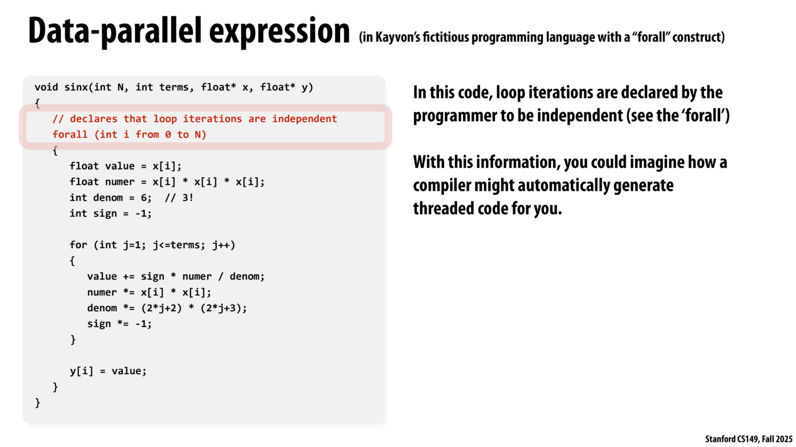

这是 CS149 课程引入的一种概念性语法，用来表达"循环的所有迭代之间彼此独立"这一语义，也就是数据的可并行性。

这也正好是 SIMD 的适配场景。

注意区分：多核并行（跨核心）与 数据并行（同一个核心内 SIMD）

对比：超标量执行 与 SIMD

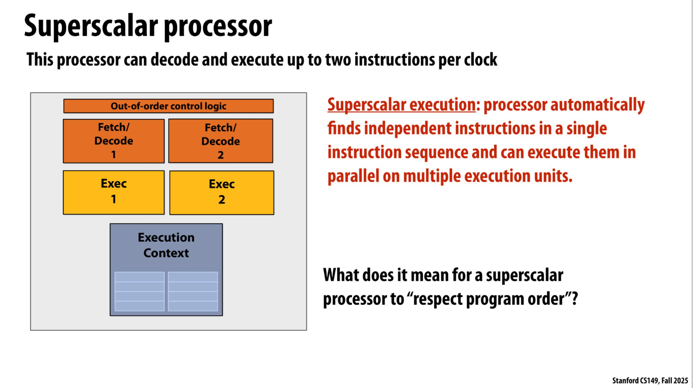

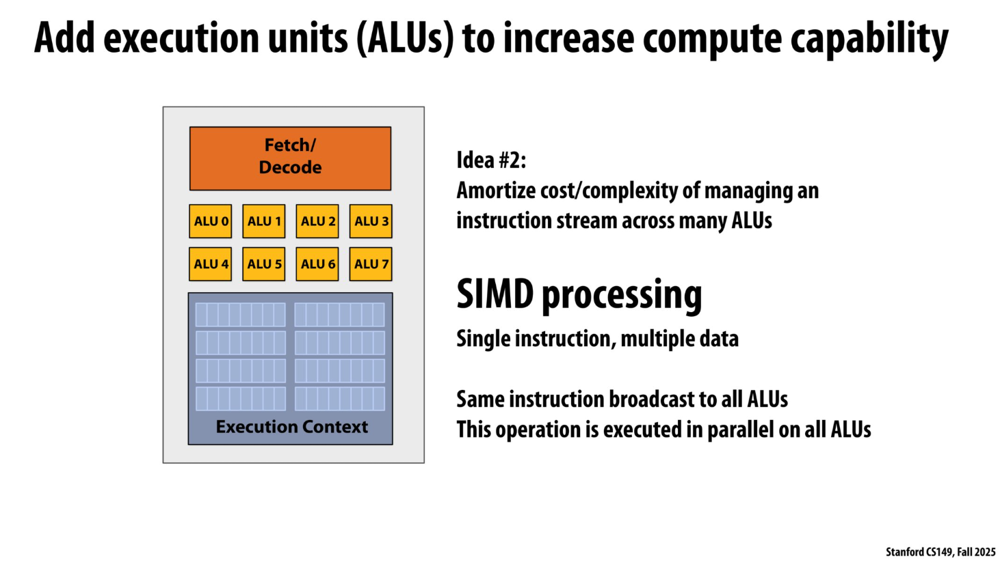

SIMD 需要尽量避免 Divergent execution。

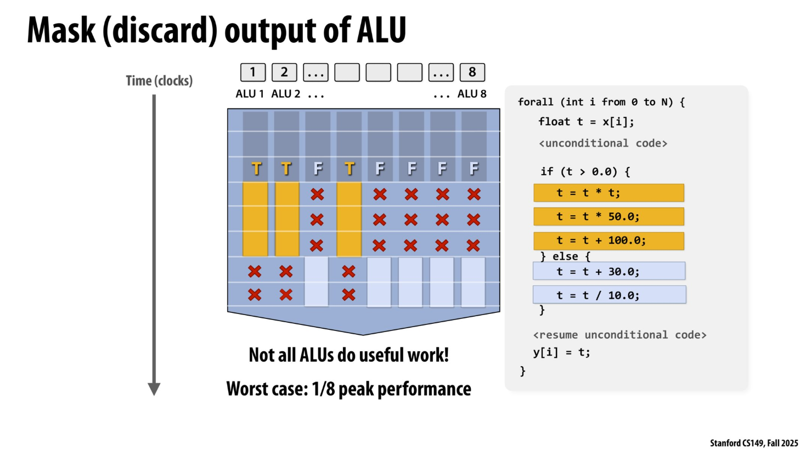

SIMD 指令集：

| 指令集 | 位宽 | 可同时操作的数据 |
| --- | --- | --- |
| Intel AVX2 | 256 位 | 8 × 32 位 或 4 × 64 位（8 宽浮点向量） |
| Intel AVX-512 | 512 位 | 16 × 32 位…… |
| ARM Neon | 128 位 | 4 × 32 位…… |

CPU 的显式 SIMD 与 GPU 的隐式 SIMD 对比：

| 特性 | CPU Explicit SIMD | GPU Implicit SIMD |
| --- | --- | --- |
| 二进制代码 | 包含 SIMD 指令（如 vstoreps） | 看起来像标量指令 |
| 并行性来源 | 编译时确定的向量化 | 运行时硬件将多个线程打包执行 |
| 对程序员 | 显式——需要写 intrinsics 或依赖编译器 | 隐式——写普通的标量代码即可 |
| 分支影响 | 相对有限（主要影响单个向量） | 严重影响 |

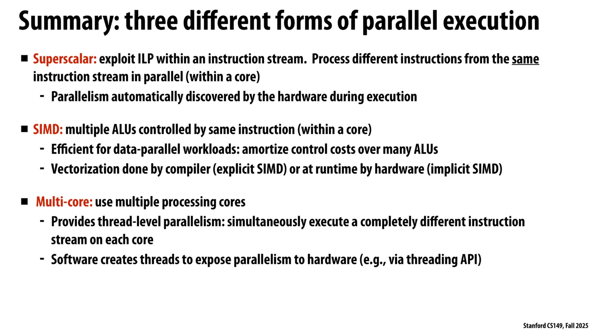

下面是一个例子：Intel-i7-7700K CPU

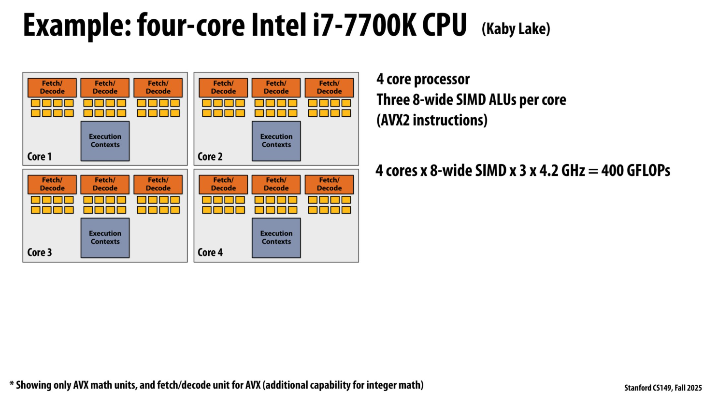

每一个 ALU 每一个时钟周期可以执行 1 条 SIMD 指令，这条指令同时对 8 个浮点数做操作，也就是产生 8 个浮点运算（FLOPs）​。

每个核心每周期 = 3 ALUs × 8 FLOPs/ALU = 24 FLOPs
所有核心每周期 = 4 cores × 24 FLOPs/core = 96 FLOPs
每秒总运算量 = 96 FLOPs/cycle × 4.2×10⁹ cycles/sec = 403.2 × 10⁹ FLOPs ≈ 400 GFLOPS

再次区分：
SIMD：单指令多数据
超标量：单线程多指令
超线程技术：同时单核多线程（还有一种“交替单核多线程”）
多核处理器：单机多核心

用一个例子理解不同维度上的并行。

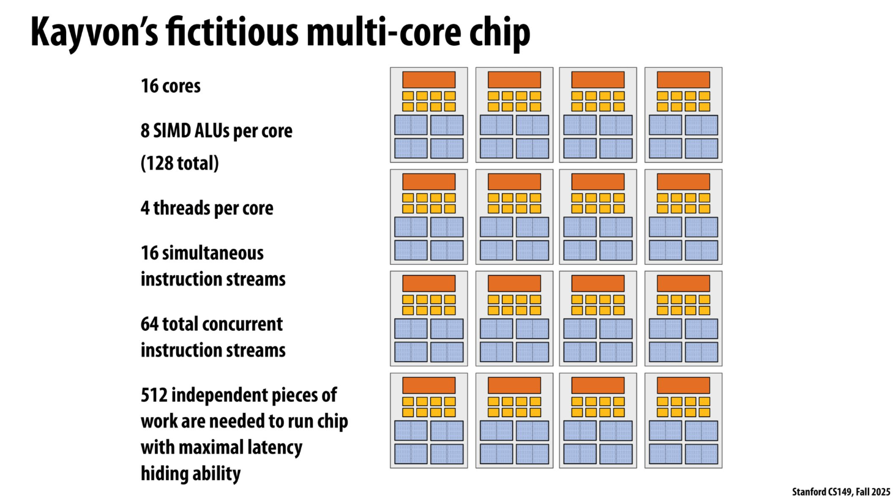

| 层次 | 参数 | 说明 |
| --- | --- | --- |
| 多核 | 16 个核心 | 每个核心是完整的物理核心 |
| 硬件多线程 | 每核心 4 个线程 | 每个核心支持 4 路硬件线程（SMT 或交替多线程） |
| SIMD | 每核心 8 个 SIMD ALU | 每个核心可同时对 8 个数据元素执行相同操作 |
| 同时指令流 | 16 个 | 16 个核心各自同时取指执行 |
| 总并发指令流 | 64 个 | 16 核心 × 每核 4 线程 = 64 个活跃硬件线程 |
| 最大化隐藏延迟所需 | 512 个独立工作单元 | 64 线程 × 8 SIMD 通道 = 512 |

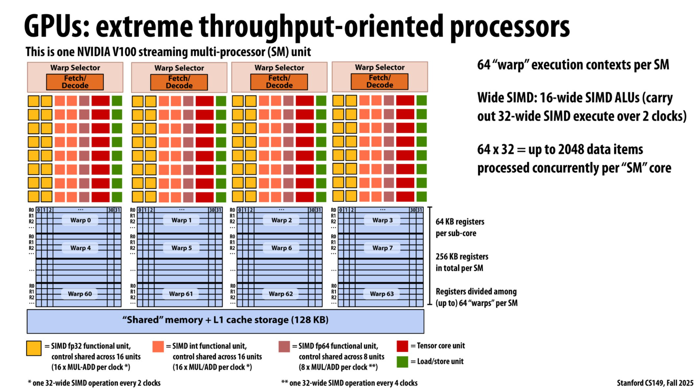

Warp 是 NVIDIA GPU 架构中的一个核心概念，简单来说：warp 是一组同时执行**同一条指令**的线程，典型的 warp 大小是 32 个线程。

从单个线程的角度看，它执行的是一条 标量加法指令——操作的是一个线程私有的单个浮点数，结果写回自己的寄存器。即：warp 内的线程是标量线程。

从而引出了 SIMD 与 SIMT 的区别：

| 维度 | SIMD | SIMT |
| --- | --- | --- |
| 编程模型 | 显式向量操作 | 标量线程 |
| 数据 | 打包在向量寄存器中 | 分布在私有寄存器中 |
| 分支 | 手动掩码 | 硬件自动屏蔽，发散时串行化 |
| 灵活性 | 数据必须结构对齐 | 线程可以各自访问不同地址 |
| 典型硬件 | x86 SSE/AVX、ARM NEON | NVIDIA GPU warp、AMD wavefront |

下面是多核 + 多线程 + 超标量核心的处理器架构。

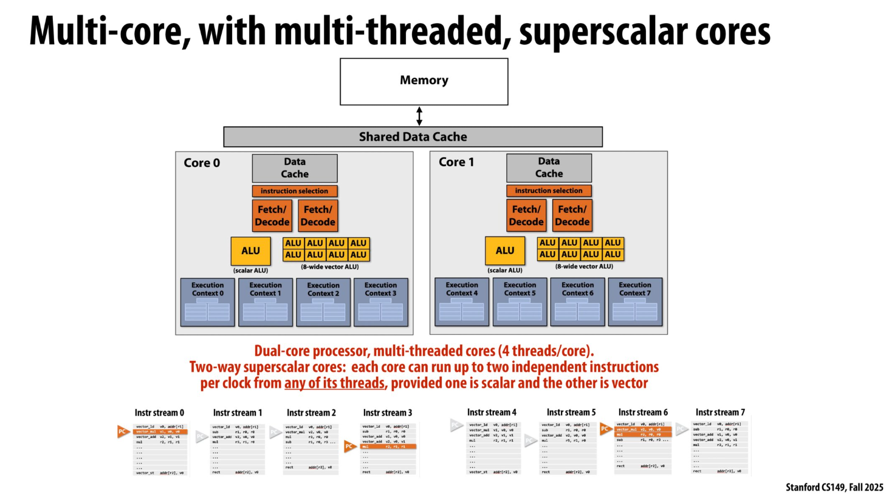

在一个核，同时发射的两条指令是不是可以来自同一个线程，也可以来自不同线程。

这是多线程 + 超标量组合的优势所在：当单个线程无法填满发射槽时（比如只有标量指令就绪而缺少向量指令），硬件可以从其他线程的已解码指令中"借用"来填补，从而提高每个周期的指令吞吐率。这种灵活性使得核心的资源利用率更高，减少了因单线程指令混合比例不理想而造成的发射槽浪费。

## 3. 现代多核架构（下）

向量元素级乘法是"尴尬并行"的经典案例。每个输出元素 C[i] = A[i] * B[i] 的计算完全独立，没有任何跨元素的数据依赖。这意味着理论上可以把数百万元素的计算任务拆分成无数个线程同时执行。

决定一个应用是否适合吞吐量处理器的关键指标是**算术强度**，即每字节数据传输能支撑多少次运算：

每次迭代的运算量：**1 次乘法**
每次迭代的访存量：2 次加载（ A[i]、B[i] ）+ 1 次存储（ C[i] ）= **12 字节**（假设单精度浮点）

$$
\text{算术强度} = \frac{1 \text{ FLOP}}{12 \text{ bytes}} \approx 0.083 \text{ FLOP/byte}
$$

这是一个**极低**的算术强度。相比之下，现代GPU的峰值算力对应的平衡点通常在几十 FLOP/byte 的量级。这意味着程序的性能**完全被内存带宽所限制（memory-bound）**，GPU 内部海量的计算单元大部分时间都在等待数据，处于闲置状态。

---

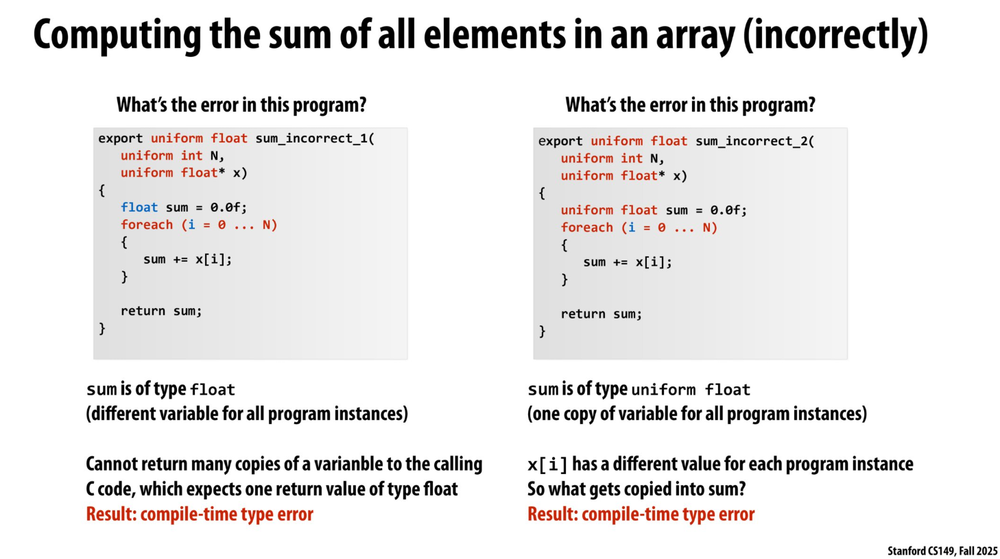

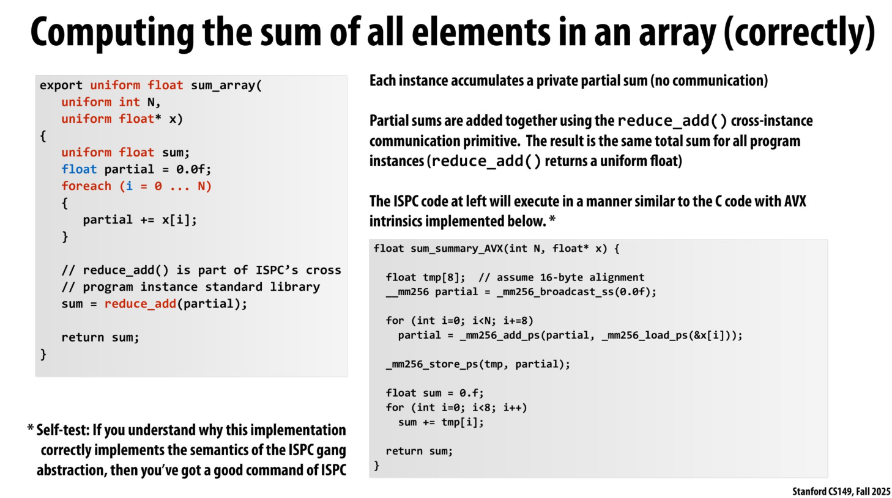

区分：抽象 与 实现