## 1. 机器级编程：x86 汇编语言

### 1.1 基本语法

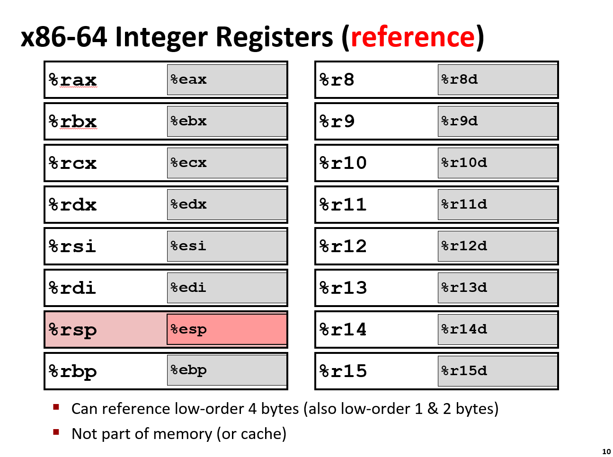

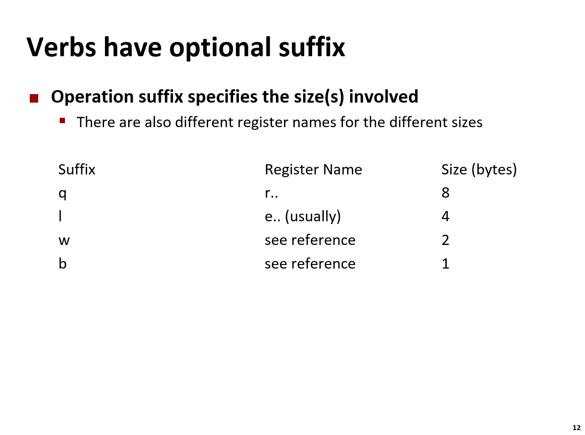

不能在一条指令中实现从一个内存地址到另一个内存地址的赋值。

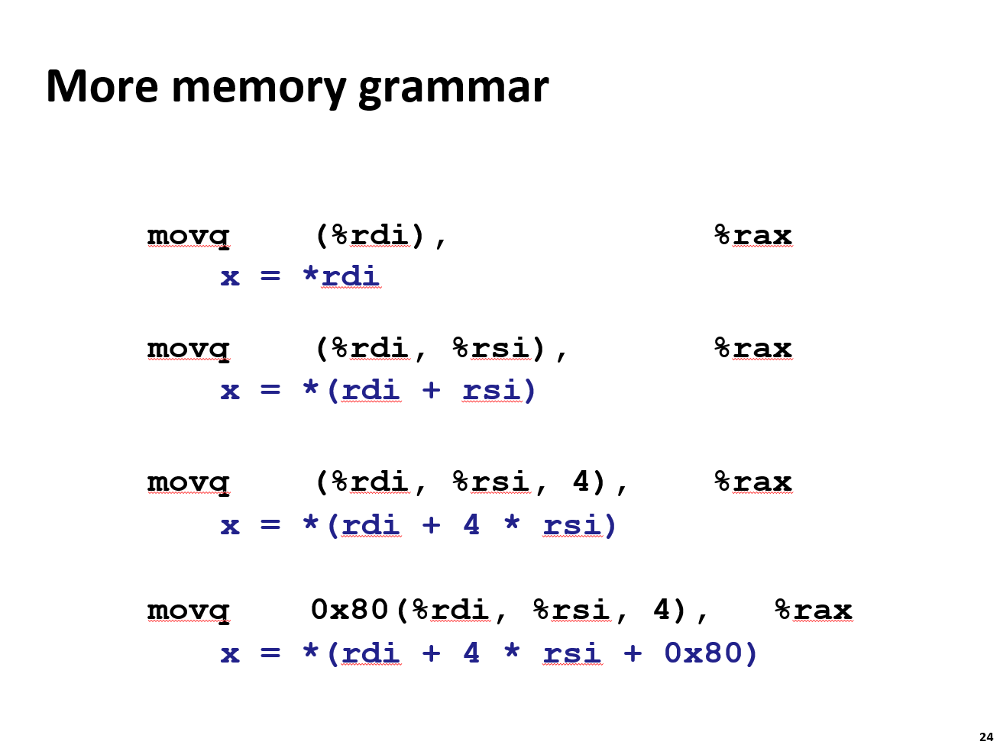

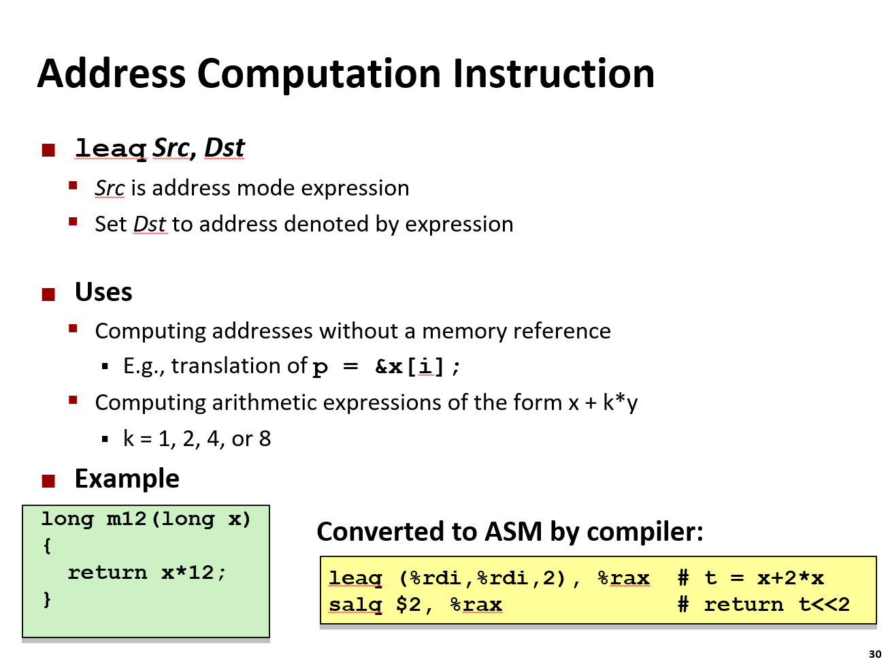

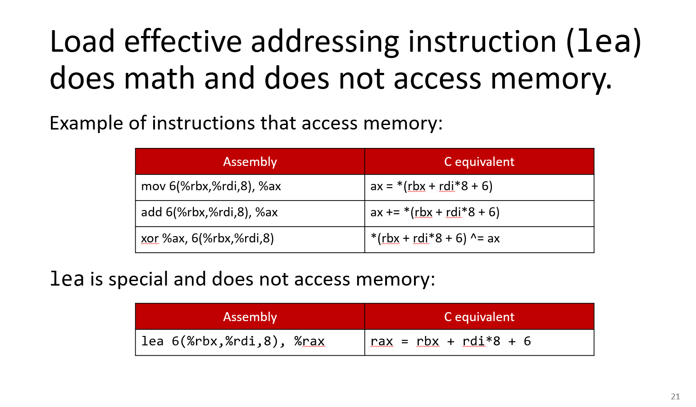

**`leaq`（Load Effective Address，加载有效地址）**。

通常我们认为 CPU 指令是用来做算术运算或内存读写的，但 `leaq` **只计算地址，不访问内存**。这使得编译器经常利用它来进行高效的数学运算。

用途：由于 `leaq` 的计算速度极快（它是 CPU 硬件层面的加法器和移位器直接完成的），它主要有两个用途。

- A. 计算指针/地址

这是它的本意。用于计算数组元素或结构体成员的地址，而不需要真正去读写内存。

**例子**：C 语言中的 `p = &x[i];`

**汇编逻辑**：计算 `Base_Address + i * Size`，结果存入 `p`。

- B. 执行快速算术运算

这是这张幻灯片的重点。因为内存寻址公式本质上是 $Base + Index \times Scale + Displacement$，这正好对应数学公式 $x + k \cdot y + c$。

编译器发现，用 `leaq` 做乘法和加法比专门的乘法指令（`imul`）更快。

**支持的系数 ($k$)**：硬件寻址逻辑只支持 $k = 1, 2, 4, 8$（对应左移 0, 1, 2, 3 位）。

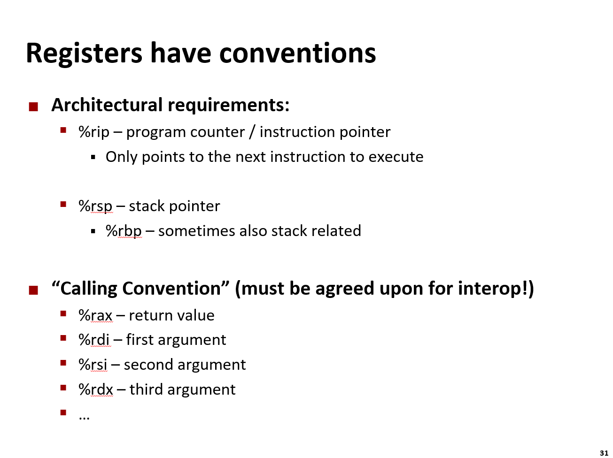

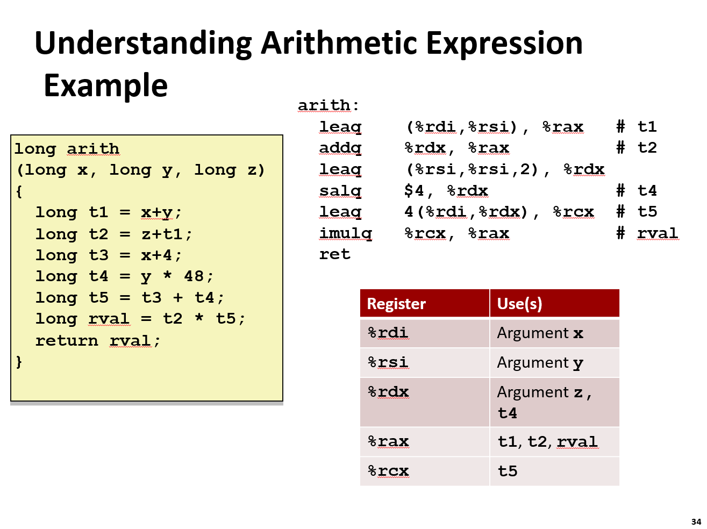

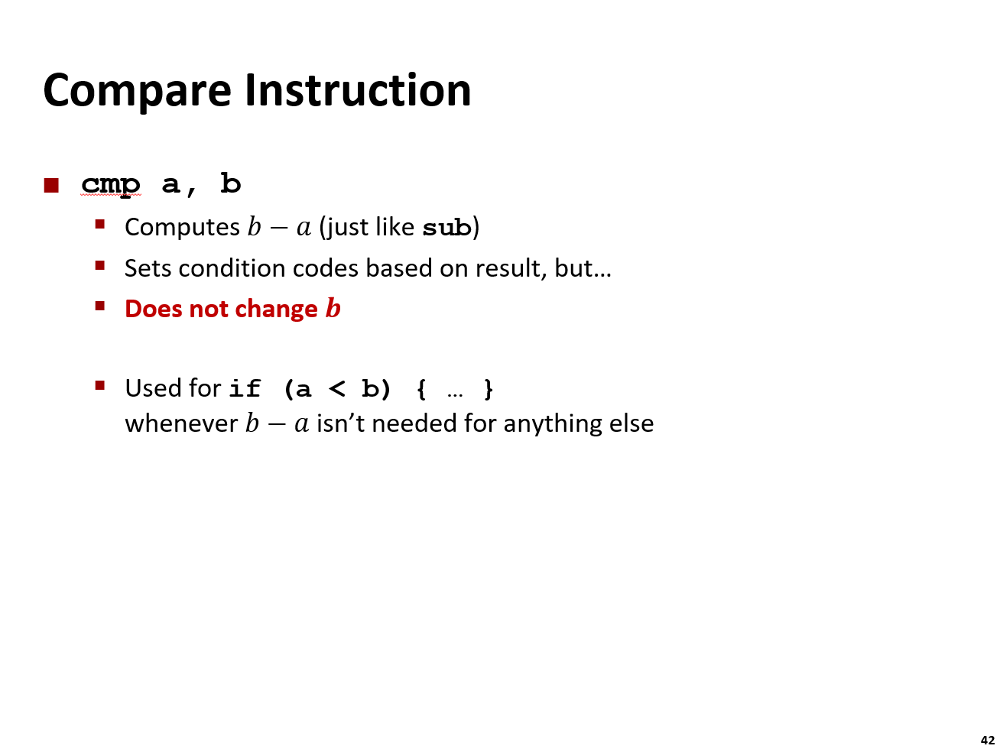

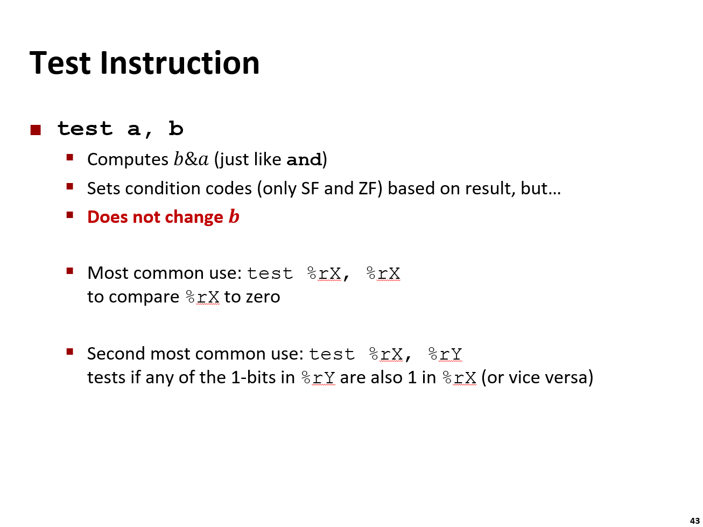

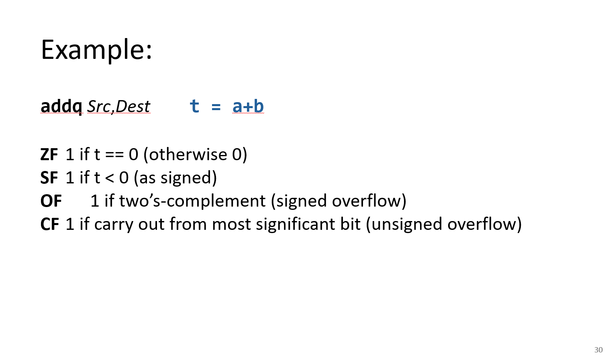

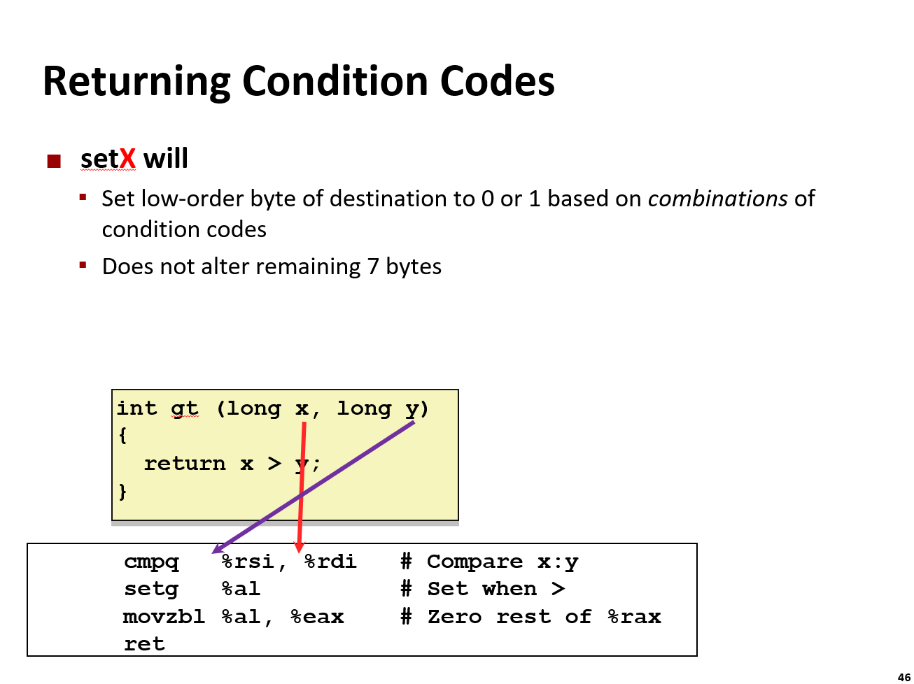

`movzbl %al, %eax`

含义： Move with Zero-Extend Byte to Long（带零扩展的字节传送到长字）。

mov 指令可以带三个后缀：第一个表示零扩展/符号扩展；第二个表示源位数，第三个表示目标位数。

为什么要这一步？ setg %al 只改了最低 8 位。但函数的返回类型是 int（通常是 32 位，对应 %eax）。如果不处理高位，%eax 里面可能残留着之前的垃圾数据。

作用： 将 %al 的值（0 或 1）复制到 %eax，并将 %eax 的高 24 位全部清零。这确保了返回值是一个干净的整数 0 或 1。

注：在 x86-64 中，写入 32 位寄存器（如 %eax）会自动将对应的 64 位寄存器（%rax）的高 32 位清零，所以这里用 %eax 作为目标也就足够作为整个函数的返回值了。


### 1.2 常见指令集架构示例


- Intel:
    - x86: 经典的 32 位个人电脑架构。
    - IA32: 通常指代 32 位的 x86 架构。
    - Itanium: 英特尔尝试过的一种基于 EPIC 架构的高端服务器处理器（已逐渐被淘汰）。
    - x86-64: 目前主流 PC 和服务器的 64 位架构。
- ARM: 采用精简指令集（RISC）设计，以低功耗著称，几乎统治了所有的移动设备（手机、平板）。
- RISC-V: 一种新兴的、开源的指令集架构。由于它是开放标准，任何人都可以免费使用和设计基于 RISC-V 的芯片，目前在学术界和嵌入式领域非常火热。

### 1.3 GCC 编译指令

#### (1) 控制编译阶段

- **`-E`**：仅执行预处理（展开宏、包含头文件），输出 `.i` 文件。
- **`-S`**：仅编译为汇编代码，输出 `.s` 文件。
- **`-c`**：仅编译和汇编，生成目标文件 `.o`，不进行链接。
- **`-o <file>`**：指定最终输出文件名（可执行文件或目标文件）。

#### (2) 优化与调试

- **`-O0`**：无优化，便于调试。
- **`-O1` / `-O2` / `-O3`**：逐级增强优化，`-O2` 是生产环境常用平衡点，`-O3` 会启用向量化等高级优化。
- **`-g`**：生成调试信息，供 GDB 使用。
- **`-Wall`**：开启所有常见警告，帮助发现潜在错误。
- **`-w`**：关闭所有警告（不推荐用于开发）。

#### (3) 路径与库管理

- **`-I<dir>`**：添加头文件搜索路径。
- **`-L<dir>`**：添加库文件搜索路径。
- **`-l<lib>`**：链接指定库（如 `-lm` 链接数学库）。

#### (4) 其他实用参数

- **`-v`**：显示详细编译过程，用于排查问题。
- **`-D<macro>`**：在编译时定义宏（如 `-DDEBUG`）。
- **`-std=c11`**：指定 C 语言标准版本。

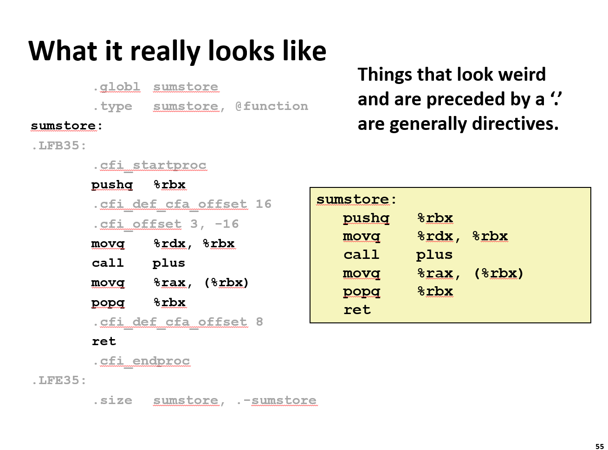

这里展示了 **GCC 编译器生成的完整汇编代码**与 **程序员通常关心的逻辑代码**之间的区别。它解释了为什么直接查看 `.s` 文件时会看到很多“奇怪”的代码。

#### 核心概念：指令 vs 伪指令

幻灯片右侧的黄色框展示了我们通常理解的、具有实际执行逻辑的汇编代码（如 `push`, `mov`, `call`, `ret`）。而左侧则是 GCC 输出的真实文件内容，其中包含大量以点号 `.` 开头的行。

- **指令：** 如 `pushq %rbx`、`movq %rdx, %rbx`。这些是 CPU 真正执行的机器码对应的助记符，负责数据的搬运和计算。
- **伪指令：** 如 `.globl`、`.type`、`.cfi_startproc`。这些 **不是** CPU 指令，而是给 **汇编器** 看的指示。它们告诉汇编器如何组织目标文件、如何生成调试信息或如何处理链接。

#### 详细解释左侧的“杂乱”代码

让我们逐行拆解左侧那些看起来复杂的伪指令：

##### 全局符号与类型声明

```assembly
.globl sumstore
.type sumstore, @function
```

- **`.globl sumstore`**：告诉链接器，`sumstore` 是一个全局符号。这意味着其他文件（如 `main.c`）可以调用这个函数。如果不加这一行，该函数默认可能是私有的。
- **`.type sumstore, @function`**：明确告诉汇编器，`sumstore` 是一个函数，而不是数据变量。这有助于调试器和链接器正确处理符号。

##### 标签

```assembly
sumstore:
.LFB35:
```

- **`sumstore:`**：这是函数的入口标签，对应代码中的函数名。
- **`.LFB35:`**：这是一个本地标签（Local Label），通常由编译器自动生成，用于标记“Function Begin”（函数开始），主要用于生成调试信息（DWARF 格式）。

##### CFI 指令

```assembly
.cfi_startproc
.cfi_def_cfa_offset 16
.cfi_offset 3, -16
...
.cfi_endproc
```

- **含义**：CFI 代表 **Call Frame Information**。
- **作用**：这些指令对于程序的 **异常处理** 和 **栈回溯** 至关重要。当程序崩溃或进行性能分析时，调试器需要知道栈帧是如何构建的（例如，哪个寄存器被保存到了栈的哪个位置）。
- **具体例子**：
    - `.cfi_startproc` / `.cfi_endproc`：标记函数体的开始和结束。
    - `.cfi_def_cfa_offset 16`：在 `pushq %rbx` 之后，栈指针移动了 8 字节，加上返回地址的 8 字节，CFA（Canonical Frame Address）的偏移量变成了 16。这帮助调试器找到上一级栈帧。

##### 尺寸定义

```assembly
.size sumstore, .-sumstore
```

- **含义**：定义符号 `sumstore` 的大小。
- **计算方式**：`.` 代表当前位置计数器。`.-sumstore` 的意思就是“当前位置减去 `sumstore` 标签的位置”，即计算出了这个函数占用了多少字节。这对于链接器分配内存非常有用。

#### Tips

虽然文件中充满了 `.cfi_...` 和 `.globl` 等伪指令，但我们只需要关注右侧黄色框中的那几行核心指令（`push`, `mov`, `call`, `pop`, `ret`），因为它们才是真正控制硬件行为、实现 C 语言逻辑的部分。

### 1.4 反汇编指令

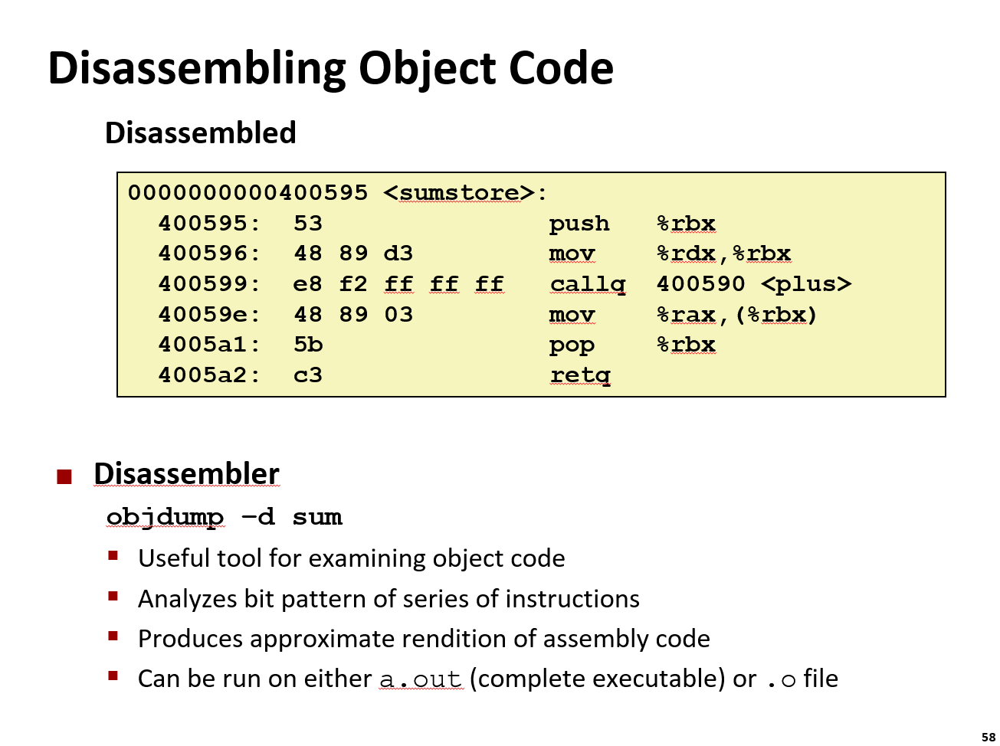

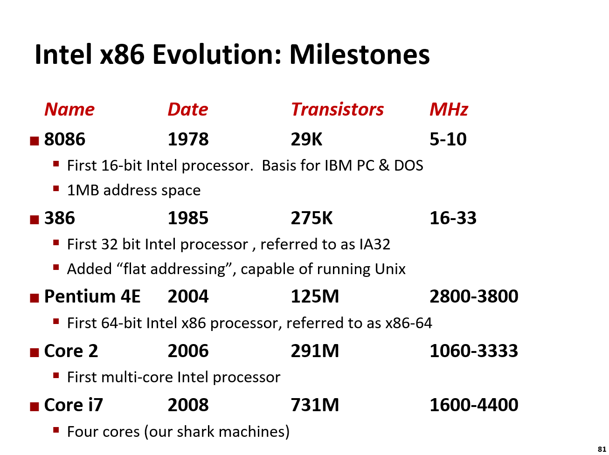

### 1.5 补充：ABI 与 ISA

**ABI**（应用程序二进制接口）是软件层面的协议，定义了编译后的二进制程序如何与操作系统、库或其他程序交互。它规定了参数传递方式、寄存器使用规则、栈帧管理、系统调用机制等底层约定，确保不同编译器或不同版本的程序能在同一平台上无缝协作。例如，C语言的`printf`函数在API层面定义其功能，而ABI则决定它在机器码中如何被调用——参数放哪些寄存器、返回值存哪里、栈如何对齐等。

**ISA**（指令集架构）是硬件与软件之间的接口，定义了CPU支持的指令、寄存器、内存模型、数据类型和特权级别等。它是程序员可见的“机器语言”，决定了软件能直接控制硬件的能力。比如x86的`addl %ebx, %eax`指令，就是ISA层面的具体操作；ARM或RISC-V也有各自不同的指令格式和寄存器布局。

#### 二者关系
- **层级不同**：ISA是硬件抽象层，ABI是软件运行时层。ISA定义了“能做什么”，ABI定义了“怎么做”。
- **依赖关系**：ABI必须基于特定的ISA来实现。例如，x86平台的ABI会规定如何使用x86寄存器和指令来传递参数；ARM平台的ABI则会适配ARM的寄存器和指令特性。没有ISA，ABI就无从谈起。
- **协同作用**：ISA提供基础能力，ABI在此基础上建立软件间的通信规范。比如，一个为x86 ISA编写的程序，若遵循Linux x86 ABI，就能在不同发行版上运行；若换一个ISA（如ARM），即使ABI相同，程序也无法直接运行，因为底层指令完全不同。