## 1. 并行代码

区分：抽象 与 实现

在 ISPC 中：

`foreach (i = 0 ... N)` 是一种抽象写法，它有几种实现方式。

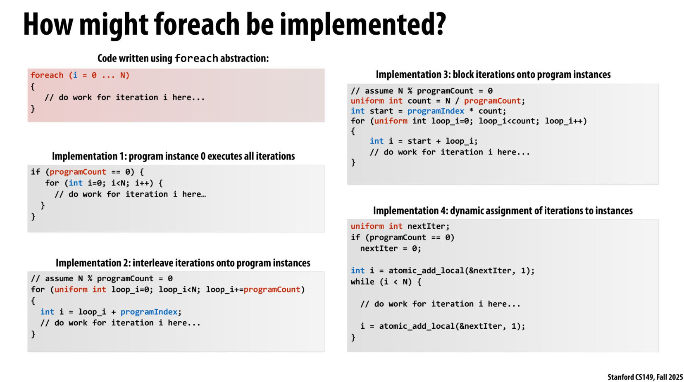

下面是一个例子。

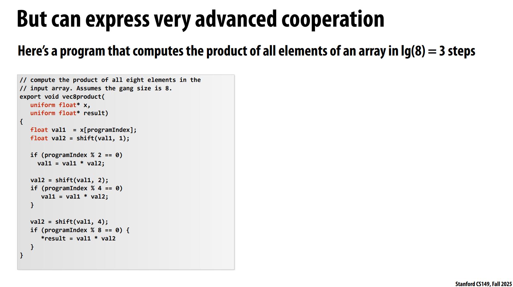

## 2. 编写并优化并行程序的思考过程

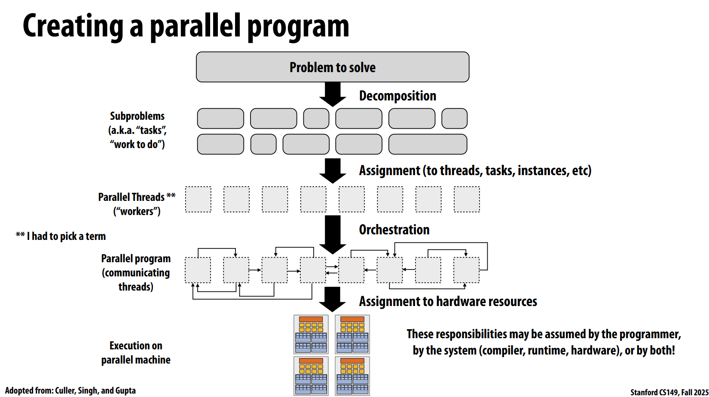

### **流程的五个阶段**

**1. 分解（Decomposition）**

从"待解决的问题"出发，将其拆解为若干个**子问题**（也称为"tasks"或"work to do"）。这是并行化的第一步——找出哪些部分可以独立计算。核心挑战是**识别数据依赖关系**：依赖越少，可并行的空间越大。

**2. 分配（Assignment）**

将分解后的子任务**分配到工人**（workers）上。这里的"workers"可以是线程、ISPC 程序实例、向量通道等。分配的目标是实现**负载均衡**并**减少通信开销**。分配可以是**静态的**（编译时确定，如手动将前一半数据给线程 A、后一半给线程 B），也可以是**动态的**（运行时根据负载情况分配，如 ISPC tasks 的 work-stealing）。

**3. 编排（Orchestration）**

在并行线程之间**组织通信和同步**。包括：
- 设计线程间的数据通信方式
- 添加必要的同步机制（如 barrier、lock）以保证正确的执行顺序
- 组织数据结构在内存中的布局以提高缓存局部性
- 调度任务的执行顺序

目标是**降低通信和同步的开销**。

**4. 硬件资源分配（Assignment to Hardware Resources）**

将软件层面的"workers"（线程）**映射到物理硬件执行单元**上：
- 操作系统分配：例如将线程映射到 CPU 核心的硬件执行上下文
- 编译器分配：例如将 ISPC 程序实例映射到向量指令通道
- 硬件分配：例如将 CUDA 线程块映射到 GPU 核心

> 将相关线程放在同一核心上：协作线程（cooperating threads，如共享数据的线程）放置在同一个核心上，可以最大化数据局部性、减少通信开销。例如，处理相邻网格点的线程放在同一核心，它们可以共享缓存中的数据。

> 将无关线程放在同一核心上：不同类型的工作负载可能互补——一个线程可能是计算密集型的，另一个是访存密集型的。将它们放在同一核心上可以让硬件资源被更充分地利用（比如计算和访存管线可以重叠执行）。

**5. 在并行机器上执行（Execution on Parallel Machine）**

最终，程序在并行硬件上实际运行。

### 一个例子：Seidel

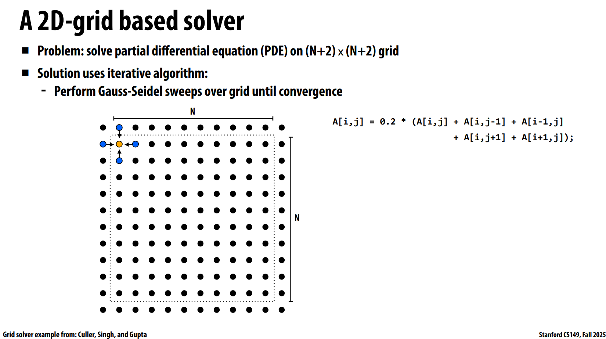

**关键要点**

寻找一种新算法，新的算法仍然迭代到相同的近似解，只是**收敛路径不同**。浮点计算的中间值可能会有差异，但最终结果会在误差阈值内收敛到同样的解。这需要一定的**领域知识**（domain knowledge）来确认这种改变是允许的——在这里，就是理解 Gauss-Seidel 方法的数学性质。

注意：**改变算法使其更适合并行化，是一种通用且重要的并行编程技巧**。很多时候，串行程序的最优算法并不是并行场景下的最优选择。并行化的目标不是"原封不动地并行化串行算法"，而是"找到在并行硬件上整体最快的算法"。

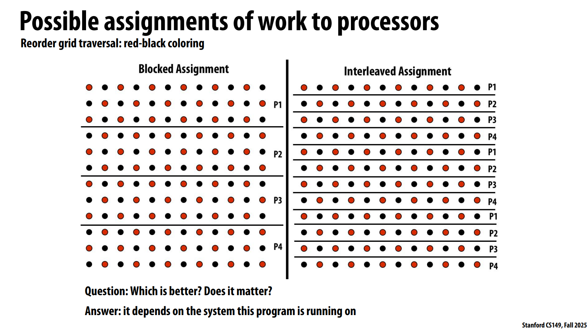

**答案：取决于系统**

**分块分配的优劣**

- **优点**：数据局部性好。每个处理器处理的是连续的内存区域，可以充分利用 CPU 缓存，并且**处理器之间需要交换的数据量少**——只有区域边界上的数据需要通信。这在**分布式内存系统**（如多机集群）或**缓存层次较深的多核 CPU** 上优势明显。
- **缺点**：如果网格不同区域的计算量不均匀，可能导致**负载不均衡**。

**交错分配的优劣**

- **优点**：负载均衡性好。每个处理器处理的点是均匀散布的，不容易出现某些处理器特别忙、某些特别闲的情况。
- **缺点**：**通信开销大**。由于每个处理器处理的区域在空间上是交错的，相邻点的更新可能分布在不同的处理器上，边界数据交换频繁。这在**通信延迟高**的系统上性能较差。

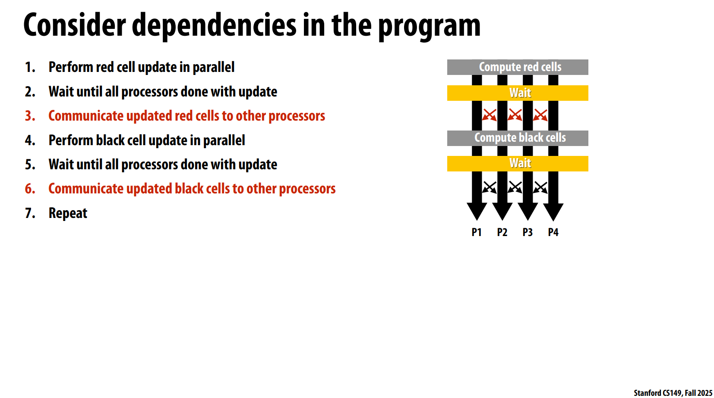

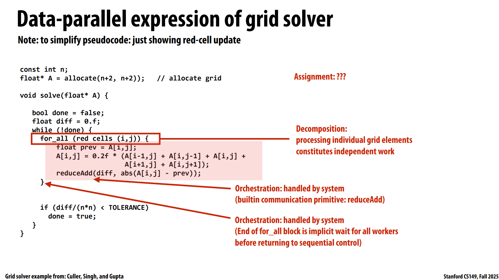

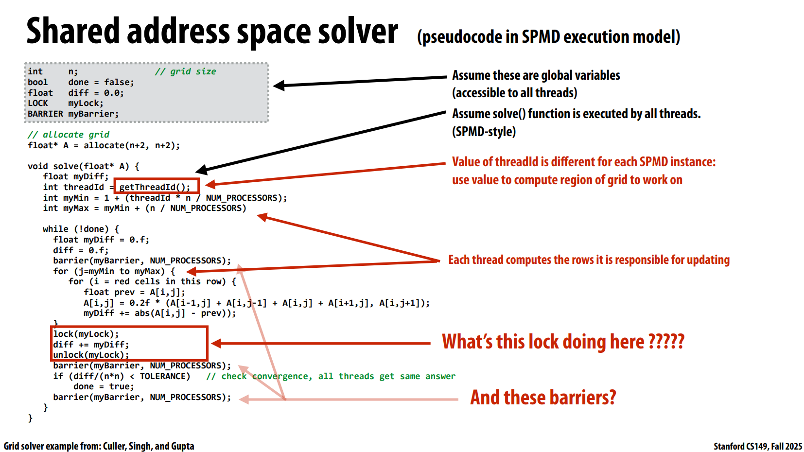

## 3. 任务负载分配

### 3.1 三种分配方式

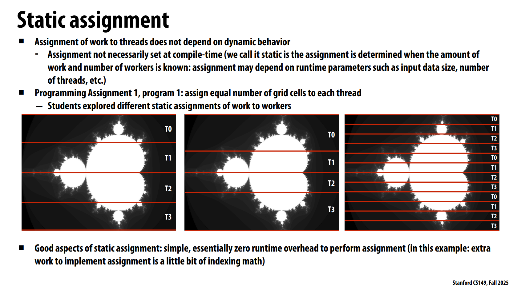

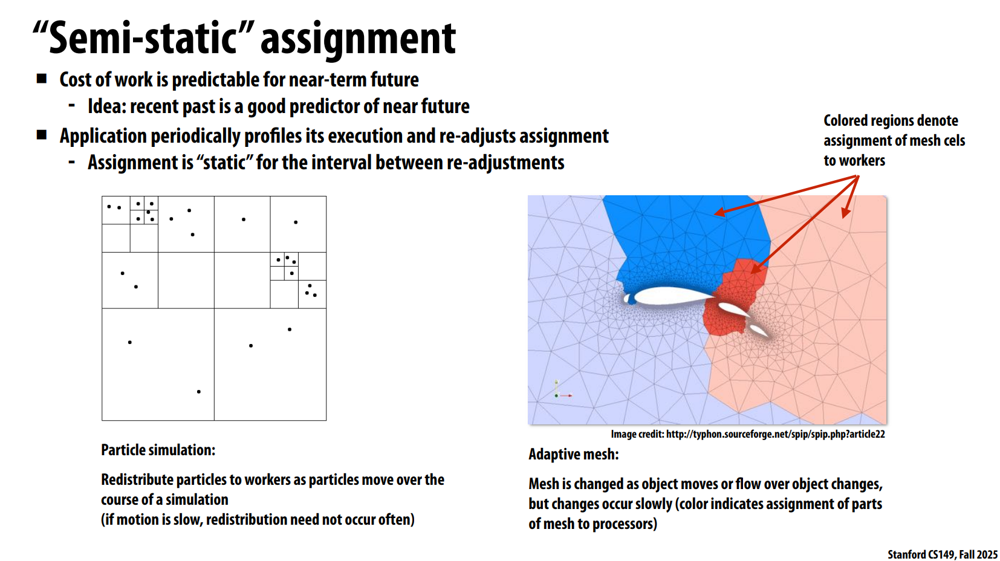

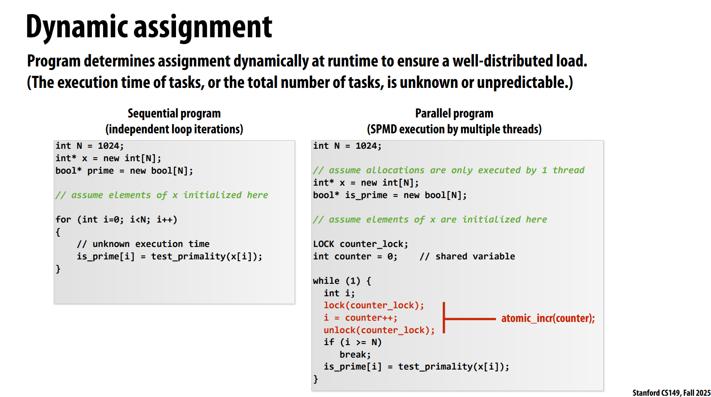

### 3.2 任务粒度

下面是一个动态分配的例子。

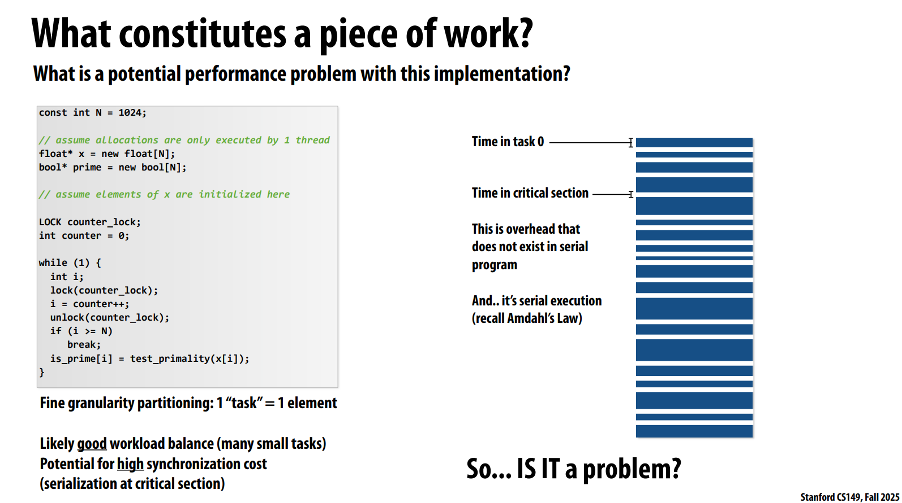

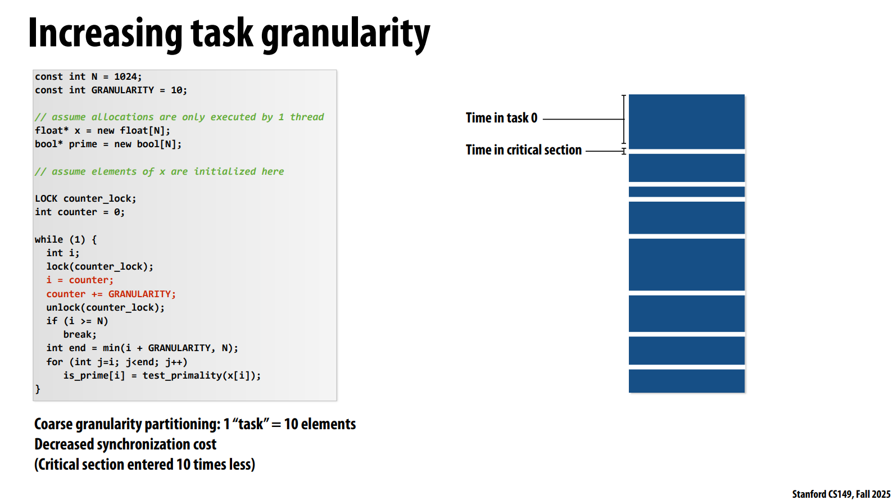

(1) 小粒度任务（Fine granularity）——负载均衡驱动

大量的小任务使得动态调度能够充分发挥作用——如果某些任务执行时间较长或较短，空闲线程总能快速获得下一个任务，从而实现良好的负载均衡。

这从负载均衡的角度鼓励小粒度划分。

(2) 大粒度任务（Coarse granularity）——开销最小化驱动

但与此同时，希望任务数量尽可能少，以最小化管理分配的开销。

这里的"开销"包括：进入临界区获取任务的同步开销、任务队列的维护开销、任务创建/调度的元数据开销等。

这从开销控制的角度鼓励大粒度划分。

结论就是，没有通用答案，结合实际情况。

### 3.3 长任务优先调度

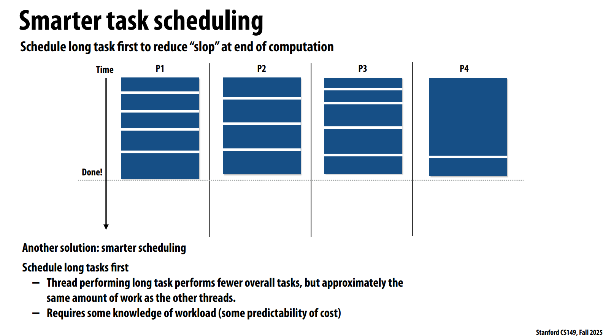

### 3.4 任务队列

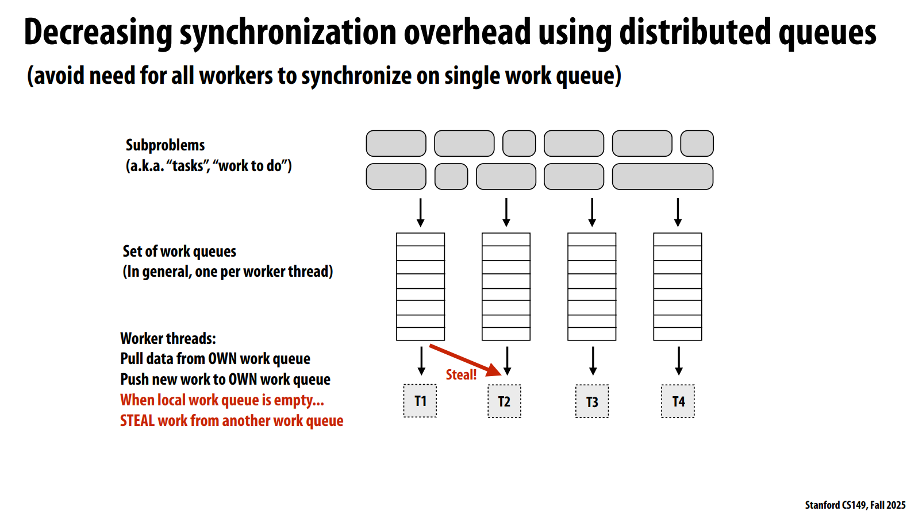

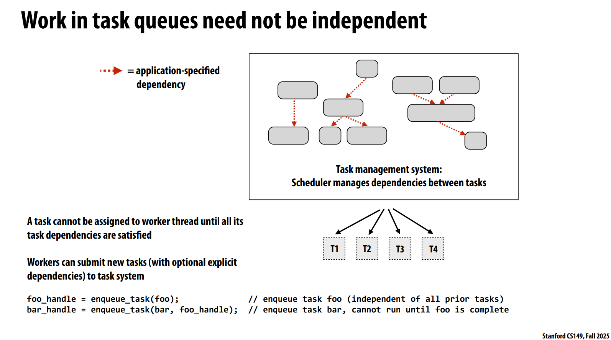

## 4. 通信开销

### 4.1 共享内存模型

**1. 通信抽象**

- 线程通过读写共享地址空间中的变量来进行通信
- 线程操作同步原语，如锁（locks）、原子操作（atomic ops）等
- 这是单处理器编程的逻辑扩展——即从单线程扩展到多线程时，编程范式保持相似

**2. 高效实现需要硬件支持**

- 任何处理器都可以从任意内存地址加载和存储数据（即每个核心都能直接访问全部内存）
- 但扩展到大量处理器时成本会很高——这也是为什么高核心数的处理器价格昂贵的原因之一
- 特别指出：**NUMA（非统一内存访问）** 架构下，要获得好的性能，程序员需要考虑数据的**局部性**——不同处理器访问不同内存区域的速度是不同的，合理安排数据位置可以显著提升性能。

### 4.2 消息传递模型

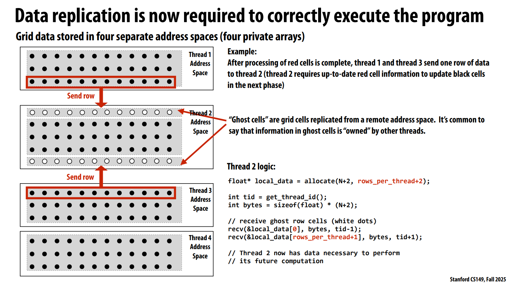

### 4.3 计算强度

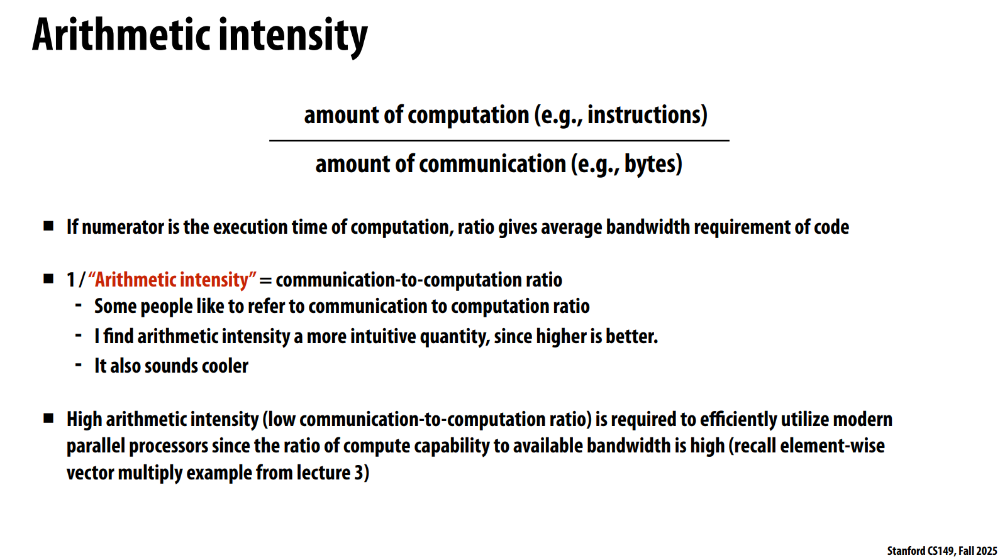

### 4.4 固有通信与人为通信

#### **固有通信（Inherent Communication）**
- 指为了完成给定算法和任务分配，**必须**在处理器之间传输的信息
- 这里有一个重要的假设前提：**假设缓存容量无限、传输粒度为最小单位**——即在理想化的系统条件下，依然无法避免的那部分通信

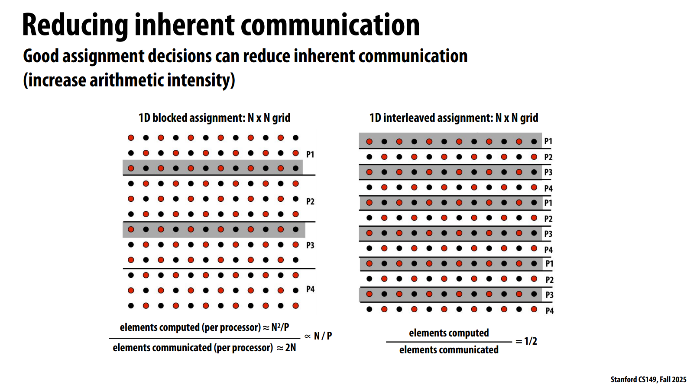

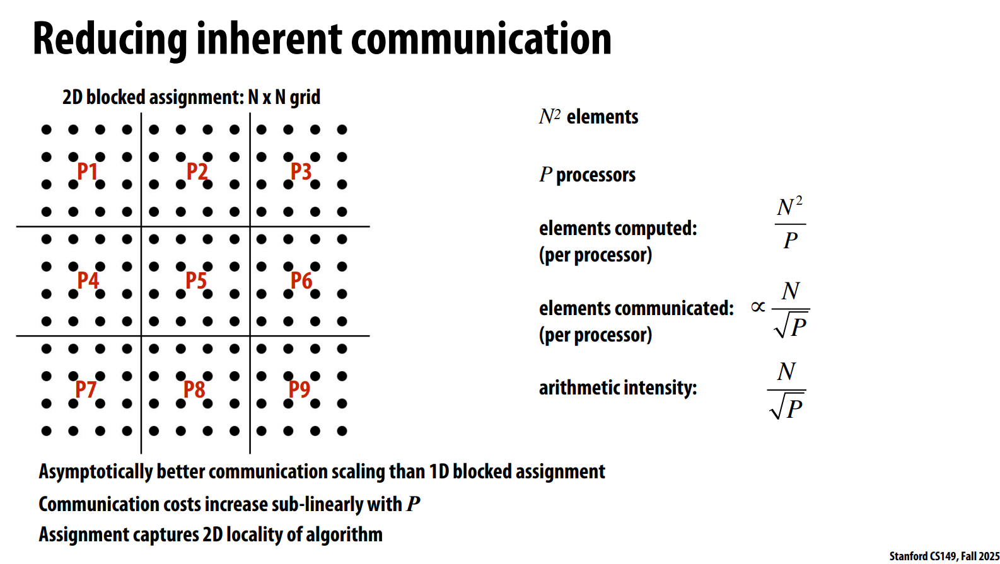

#### **人为通信（Artifactual Communication）**
- 指**所有其他**通信——即不是算法本身必需的，而是由**系统实现的具体细节**带来的额外通信
- 这些通信源于实际硬件的各种限制，而非算法逻辑本身的要求

**常见的产生原因**

后续幻灯片给出了具体例子：
1. **最小传输粒度**：系统必须按缓存行（cache line）传输数据，但程序可能只需要其中的一个元素。例如加载一个4字节的float，但整个64字节的缓存行都必须从内存传输过来，导致**16倍的额外通信**
2. **写分配行为**：程序写16个连续的float，缓存行先被加载到缓存，然后全部覆盖写入，再写回内存——加载步骤其实是多余的
3. **有限缓存容量**：同一个数据因缓存装不下而被反复淘汰又加载，造成**容量失效**（capacity misses），如网格求解器中行主序遍历时上一行的数据在访问下一行时已经被逐出缓存

区分这两种通信的意义在于：**固有通信**可以通过更好的任务分配和数据分区来减少（如2D分块替代1D分块），而**人为通信**则需要通过优化代码的局部性（如循环分块、循环融合等技术）来降低。

### 4.5 减少通信开销总结

**1. 减少通信对发送方/接收方的开销**
- **发送更少的消息**——减少消息数量本身就降低了总开销
- **将小消息合并为大消息**（coalescing）——每次消息传递都有固定的开销（如协议处理、握手等），把多个小消息合并成一个大消息可以分摊这些固定开销，提高有效带宽利用率

**2. 减少通信延迟**
- **应用开发者层面**：重构代码以利用**局部性**（locality），让处理器尽可能访问本地缓存中的数据，避免远程访问
- **硬件实现者层面**：改进通信架构（如使用更快的互连网络、更高效的路由算法）

**3. 减少竞争（contention）**
- **复制竞争资源**——例如将共享计数器改为每个线程维护本地副本，最后再合并；或者使用细粒度锁代替粗粒度锁
- **错开对竞争资源的访问**——让不同处理器在不同时间访问热点资源，避免同时涌入造成拥塞

**4. 增加通信/计算的重叠**
- **应用开发者层面**：使用**异步通信**（asynchronous communication），如在消息传递中使用非阻塞 send/recv，发送消息后不等待完成，而是先做其他计算，等需要数据时再检查消息是否到达
- **硬件实现者层面**：采用流水线（pipelining）、多线程（multithreading）、预取（prefetching）、乱序执行（out-of-order execution）等技术来隐藏通信延迟
- **关键前提**：应用程序需要有**比执行单元数更多的并发**（more concurrency than number of execution units），这样当一个线程在等待数据时，硬件可以切换到另一个可执行的线程继续工作

## 5. 扩展性

**问题规模与机器规模的交互**

问题的大小和并行计算机的大小之间存在复杂的相互作用，这会影响到：
- **负载均衡**——处理器分到的任务是否均匀
- **并行开销**——通信、同步等额外成本
- **计算强度**（arithmetic intensity）——计算量与通信量的比值
- **数据访问的局部性**——工作集能否放入缓存

而且这些影响**因应用而异**，没有放之四海皆准的规律。

**固定问题规模评估的问题**

如果评估并行机器时总是使用同样大小的问题，会出现两类问题：

**问题太小**
- 并行开销（通信、同步）会**主导并行收益**，甚至可能导致比单核更慢
- 问题规模适合小机器，但对于大机器来说完全不现实——你不会买一台32核的机器只为了算一个小问题

**问题太大**
- 关键工作集可能**不适合小机器**——比如工作集超过内存容量导致频繁换页到磁盘（thrashing），或者超出缓存容量导致大量缓存失效
- 当问题工作集在大机器上能"装下"而在小机器上装不下时，甚至会出现**超线性加速**（super-linear speedup）——这不是因为并行本身有多高效，而是因为小机器在内存/缓存上就已经不堪重负了

**建议的做法**

随着机器规模增长，**按比例扩大问题规模**（scaled problem size）通常更合理。也就是说，买更大的机器应该是为了**计算更多的东西**（解决更大的问题），而不是为了**更快地计算同一个问题**。这也是为什么在并行计算中，强扩展（fixed-size speedup）和弱扩展（scaled speedup）是两种不同的评估方式。