## 1. GPU 架构

因为早期的 GPU 的硬件接口只接受图形渲染命令，并没有所谓的"通用计算模式"。研究人员必须把科学计算问题伪装成图形渲染问题：数据伪装成纹理、计算伪装成着色器、结果伪装成输出图像。这种方法虽然可行，但非常别扭——不过它证明了 GPU 作为数据并行加速器的巨大潜力，直接催生了后来的 Brook 流编程语言和 NVIDIA 的 CUDA。

Brook 是 GPGPU 从"土办法"走向编程语言抽象的重要一步，它直接影响了后来 NVIDIA CUDA 的设计思路。可以说 Brook 证明了"用类 C 语言编写 GPU 程序"是可行的，为 2007 年 CUDA 的诞生铺平了道路。

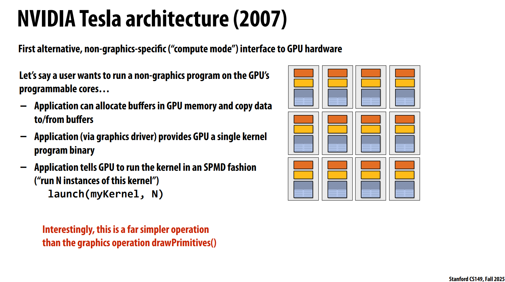

2007 年，NVIDIA 的 Tesla 架构首次提供了非图形专用的"计算模式"接口，摆脱了之前只能通过图形渲染管线使用 GPU 的限制。

Tesla 架构提供的新接口要简单得多：

- 应用程序可以在 GPU 内存中分配缓冲区，并在 CPU 与 GPU 之间拷贝数据。
- 通过图形驱动向 GPU 提供一个单一的内核程序二进制。
- 告诉 GPU 以 SPMD（单程序多数据）​ 方式运行这个内核——launch(myKernel, N)，即启动 N 个内核实例并行执行。

随后就是 CUDA 的出现，有三个核心要点。

首先，CUDA 于 2007 年随 NVIDIA Tesla 架构一同推出，这一点在时间上并非巧合——Tesla 架构提供了计算模式硬件接口，而 CUDA 就是用来编程这个接口的语言，两者是同时诞生的。

其次，CUDA 是一种类似 C 的语言，用于表达在 GPU 上运行的程序。这意味着程序员不需要学习完全陌生的语法，也不需要把计算伪装成图形渲染（像之前提到的 Brook 或 Hack 方法那样），而是可以直接编写要在 GPU 上执行的代码。

第三，CUDA 被设计为相对底层的语言。CUDA 的抽象与 GPU 硬件的性能特性紧密匹配，设计目标是保持低抽象距离（low abstraction distance）。这句话的意思是，CUDA 的编程模型（线程层次结构、内存模型、同步原语等）直接映射到 GPU 物理架构的运作方式上，让有经验的程序员能够精确控制硬件资源的利用，充分发挥 GPU 的性能潜力

## 2. CUDA

### 2.1 线程层次结构

CUDA 将并发线程组织为：

- **Grid（网格）**：一次内核启动（kernel launch）所产生的所有线程构成一个网格。网格由多个线程块组成，最多可以是三维的。
- **Block（线程块）**：网格中的一组线程，线程块内的线程可以通过共享内存协作，并通过 `__syncthreads()` 进行同步。
- **Thread（线程）**：CUDA 程序中最基本的执行单元。

**代码示例：**

```c
dim3 threadsPerBlock(4, 3);   // 每个线程块包含 4x3 = 12 个线程
dim3 numBlocks(12/4, 6/3);    // 网格包含 3x2 = 6 个线程块

matrixAdd<<<numBlocks, threadsPerBlock>>>(A, B, C);
```

这个例子中：
- 问题规模是 12x6 的矩阵。
- 每个线程块包含 12 个线程（4x3 排列）。
- 网格包含 6 个线程块（3x2 排列）。
- 总共启动 **72 个 CUDA 线程**（6 个块 × 12 个线程/块）。

**设计意图：**

使用多维线程 ID 是为了方便处理本身具有多维性质的问题（如图像处理、矩阵运算）。每个线程可以通过 `blockIdx`（块在网格中的索引）、`threadIdx`（线程在块中的索引）和 `blockDim`（块的维度）计算出自己负责处理的数据位置。这种两层结构还隐含着另一层重要含义：**线程块内的线程可以协作（共享内存 + 同步），而跨线程块的线程之间没有直接的同步机制**——这直接映射到 GPU 硬件的调度方式上。

### 2.2 一个简单示例

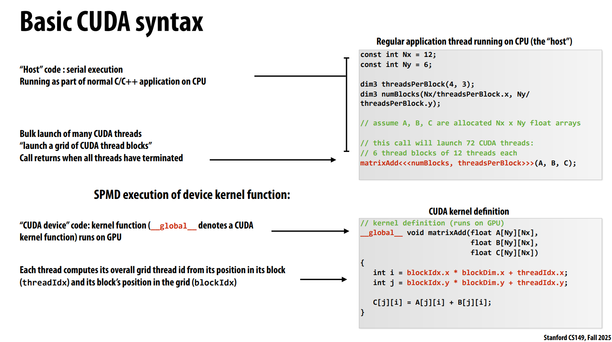

### 2.3 内存模型

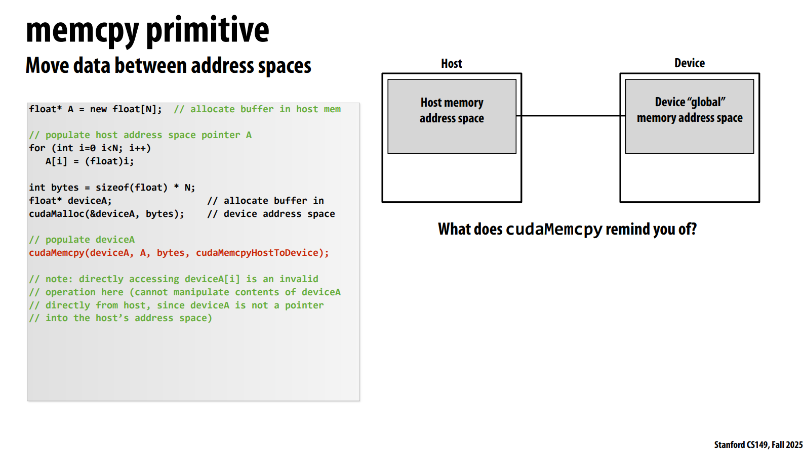

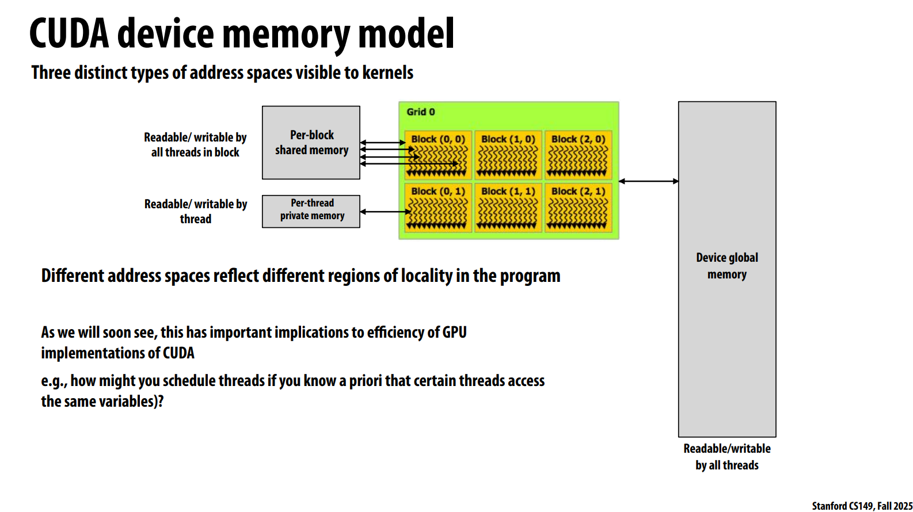

展示了 CUDA 内核可见的三种不同类型的地址空间，它们代表了不同层次的**数据局部性**。

**三种地址空间：**

1. **Per-thread private memory（线程私有内存）**——仅线程自身可读可写。这对应每个 CUDA 线程的局部变量（如函数中的自动变量、寄存器等）。每个线程有自己的私有副本，其他线程不可见。

2. **Per-block shared memory（线程块共享内存）**——同一线程块内的所有线程可读可写。这是一种由程序员管理的片上高速缓存，用于线程块内线程之间的数据共享和协作。它的访问延迟远低于全局内存。

3. **Device global memory（设备全局内存）**——所有线程（以及主机）均可读可写。这就是 GPU 的板载 DRAM（显存），容量大（可达数十 GB）但延迟较高。

下方的文字指出，不同的地址空间反映了程序中不同的**局部性区域**，这对 GPU 实现 CUDA 的效率有重要影响。幻灯片末尾提出了一个思考问题：如果你事先知道某些线程会访问相同的变量，你会如何调度线程？——这暗示了 shared memory 的设计动机：当线程块内的多个线程需要频繁访问同一份数据时，将它们调度到同一个 SM（流式多处理器）上，并通过共享内存进行数据交换，可以大幅减少对慢速全局内存的访问。这种显式的内存层次管理是 CUDA 性能优化的核心所在。

### 2.4 另一个示例

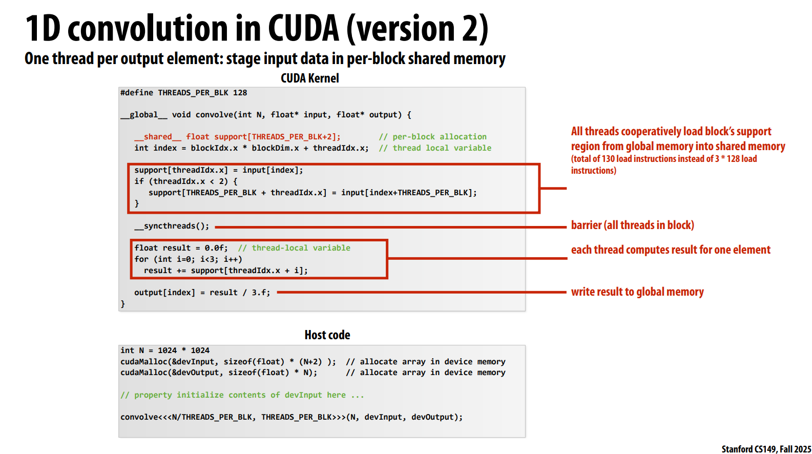

在之前的版本 1 中，每个线程负责计算一个输出元素，需要从全局内存读取 3 个输入值（input[index]、input[index+1]、input[index+2]）。对于 128 个线程的线程块，总共需要 3 × 128 = 384 次全局内存读取。全局内存（显存）延迟很高，这会成为性能瓶颈。

这个 `__shared__` 声明在共享内存中分配了一个数组，大小为 128 + 2 = 130，足够容纳当前块所需的全部输入数据（每个线程负责一个元素，加上卷积核宽度 3 所需的额外 2 个边界元素）。

块内的所有线程协同工作：每个线程将自己在全局内存中的对应元素加载到共享内存中。前 2 个线程额外多加载 2 个边界元素。这样总共只有 130 次全局内存读取（而不是原来的 384 次），大幅减少了对慢速全局内存的访问。

### 2.5 CUDA编译

**编译后的 CUDA 设备二进制包含两部分内容**：

1. **程序文本（指令）**——即 kernel 的机器码
2. **所需资源信息**——包括：
   - 每线程块所需的线程数
   - 每线程的本地数据量（寄存器使用情况）
   - 每线程块的共享内存大小

这些资源信息是由 CUDA 编译器（`nvcc`）在编译 kernel 时**静态分析**得出的。编译器扫描 kernel 代码中的变量声明、数组大小、`__shared__` 使用等，精确计算出每个线程块所需的硬件资源量，并将这些元数据打包到设备二进制中。

下方的 host 代码展示了一个典型的 CUDA 启动：

```cpp
convolve<<<N/THREADS_PER_BLK, THREADS_PER_BLK>>>(N, devInput, devOutput);
```

当 `N = 1024 * 1024` 时，这意味着要启动 **8192 个线程块**。GPU 的线程块调度器需要知道每个块消耗多少资源，才能回答以下问题：

- 每个 SM 上最多能同时驻留多少个线程块？
- 资源瓶颈在哪里——是线程数（最大 warp 数）、共享内存容量，还是寄存器数量？

**与 GPU 运行时调度的衔接**

下面展示了线程块调度器如何利用这些资源信息，将线程块动态分配到 SM 上。调度器读取二进制中的资源需求元数据后，对比 SM 的硬件资源容量（如共享内存总量、寄存器总数、最大 warp 数），决定每个 SM 上能同时驻留多少个线程块。在本例中，如果 SM 的共享内存只有 1.5 KB，而每个块需要 520 字节，那么一个 SM 最多只能同时容纳 2 个块（3 × 520 = 1560 > 1536），即使还有空闲的线程槽位也无法分配更多块。

这揭示了 CUDA 编译器的一项关键职责：**将高层次的 kernel 代码转化为带有资源标注的二进制**。这使得 GPU 的硬件调度器能够"感知"每个计算任务的资源消耗，从而在运行时做出最优的工作分配决策。这种编译时静态分析 + 运行时动态调度的协作模式，是 CUDA 能够在无需程序员手动管理硬件资源的情况下，实现高效并行执行的核心机制之一。

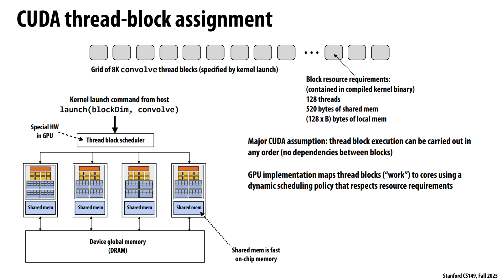

### 2.6 Warp

warp 不是 CUDA 语言的一部分，但它是理解 CUDA 在现代 NVIDIA GPU 上实现的重要细节。

从 CUDA 编程模型角度看，我们启动的是独立的"线程"；从硬件实现角度看，GPU 实际调度和执行的是 32 线程一组的 warp。每个 V100 子核可以管理多达 16 个 warp（512 个线程），通过快速 warp 间切换来隐藏访存延迟——这是 GPU 之所以能够达到超高吞吐量的微观基础。

## 3. 数据并行思想

### 3.1 核心数据类型：序列

**序列的定义**：它是一个有序的元素集合。与普通数组不同，序列的关键约束在于——程序只能通过特定的操作来访问序列中的元素，而不能像数组那样通过下标直接随机访问。这一设计上的限制恰恰是实现高效并行的基础。

**在不同语言中的体现**：
- **C++** 中表示为 `Sequence<T>`
- **Scala** 中为 `List[T]`
- **Python** 中为 **Pandas DataFrames**（表格型数据）
- **PyTorch / JAX** 中为 **Tensors（张量）**，即 N 维序列
- **Haskell** 等函数式语言中为 `seq T`

为什么"不能直接访问元素"反而重要？因为当你只能通过 `map`、`filter`、`scan`、`fold` 等高层操作来操作序列时，这些操作的实现（而非程序员）拥有自由决定**如何并行执行**的权利。例如 `map` 的实现可以将输入序列切分成多个子序列，分配到不同的核心上同时处理——这些细节对使用者完全透明。这正是数据并行模型"描述要做什么，而非怎么做"的核心哲学。

### 3.2 Map操作

map 接受一个函数 f :: a -> b 和一个输入序列，对每个元素应用 f 后产生等长的输出序列。幻灯片强调了一个核心性质：​f 是无副作用的纯函数。这意味着，无论按照什么顺序——从头到尾、从尾到头、或者完全乱序——对序列中的每个元素执行 f，最终的输出序列都是相同的。

这个策略的优雅之处在于其简洁性——map 的并行化几乎不需要任何同步或通信，因为每个元素的计算完全独立。

### 3.3 Fold操作

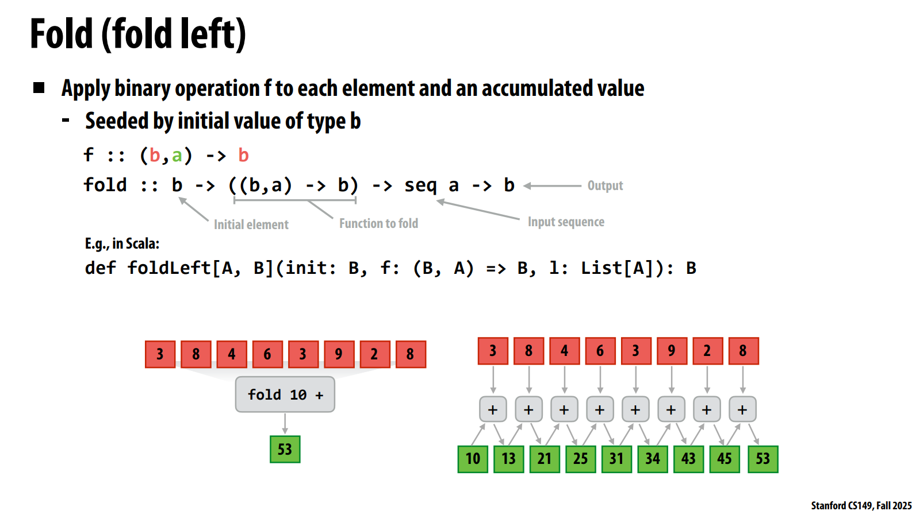

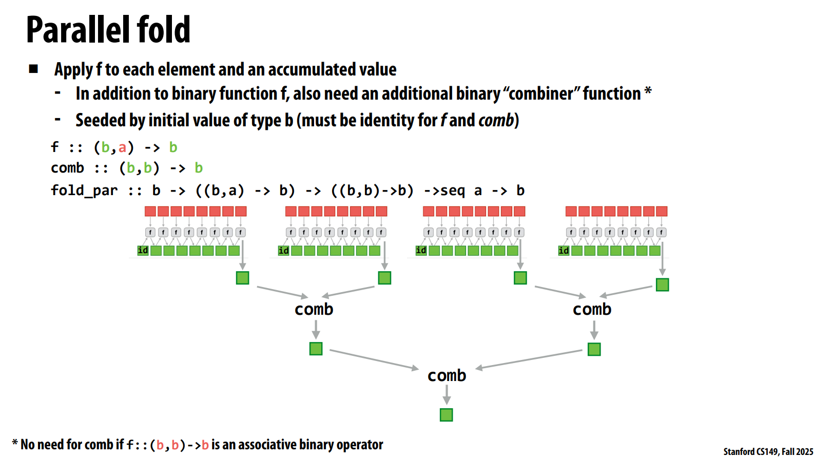

### 3.4 Scan操作

给定一个序列（数组）\( A = [a_0, a_1, a_2, a_3, \dots, a_{n-1}] \)，以及一个**结合二元运算符** \( \oplus \)（该运算符具有单位元 \( I \)）。

- **Inclusive Scan（包含扫描）：** 输出序列中每个位置的结果，是输入序列中**从开头到当前位置**所有元素经过 \( \oplus \) 运算的累积值。课件中给出的形式：

  \[
  \text{scan\_inclusive}(\oplus, A) = [a_0,\; a_0 \oplus a_1,\; a_0 \oplus a_1 \oplus a_2,\; \dots]
  \]

- **Exclusive Scan（排除扫描）：** 输出序列中每个位置的结果，是输入序列中**从开头到当前位置之前一个元素**（即排除当前元素）的累积值。单位元 \( I \) 作为第一个元素：

  \[
  \text{scan\_exclusive}(\oplus, A) = [I,\; a_0,\; a_0 \oplus a_1,\; \dots]
  \]

当这个运算符是加法时，包含扫描（Inclusive Scan）操作就是前缀和。

下面是Inclusive Scan操作的朴素并行实现。这个操作的总工作量是 O(nlogn)，比串行的 O(n) 的工作量更大。但最长的依赖链长度是 O(logn)，因此这个操作的并行效率更高。

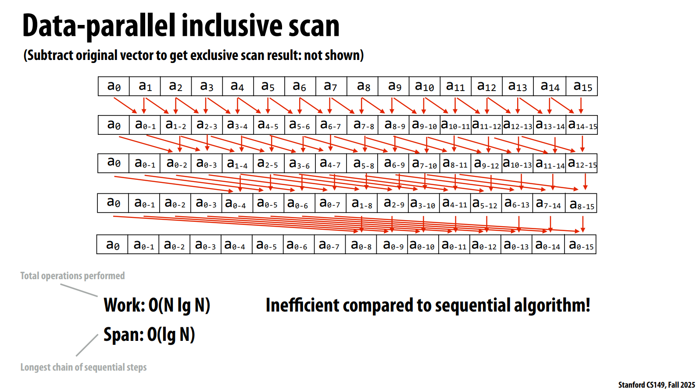

接下来是Exclusive Scan操作的两种并行实现。前者是理论上高效的实现 O(n)，后者的工作量是 O(nlogn)。**实际选择哪种实现，需要考虑实际硬件资源。**

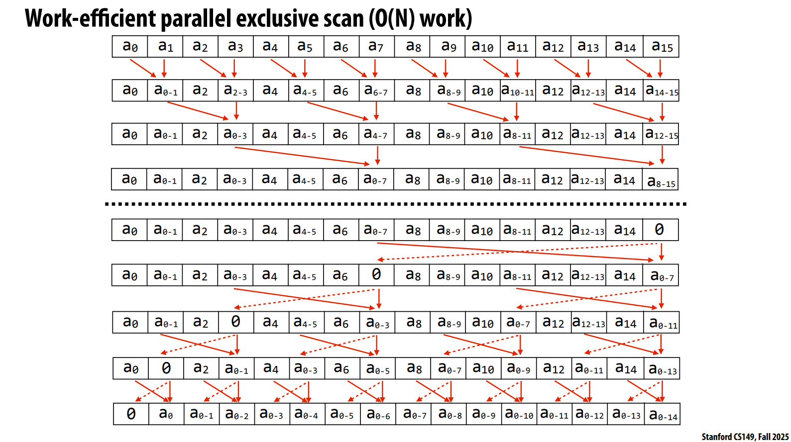

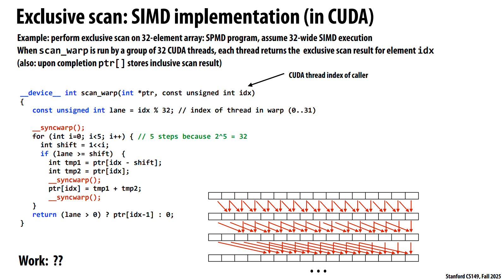

接下来是多核并行实现。

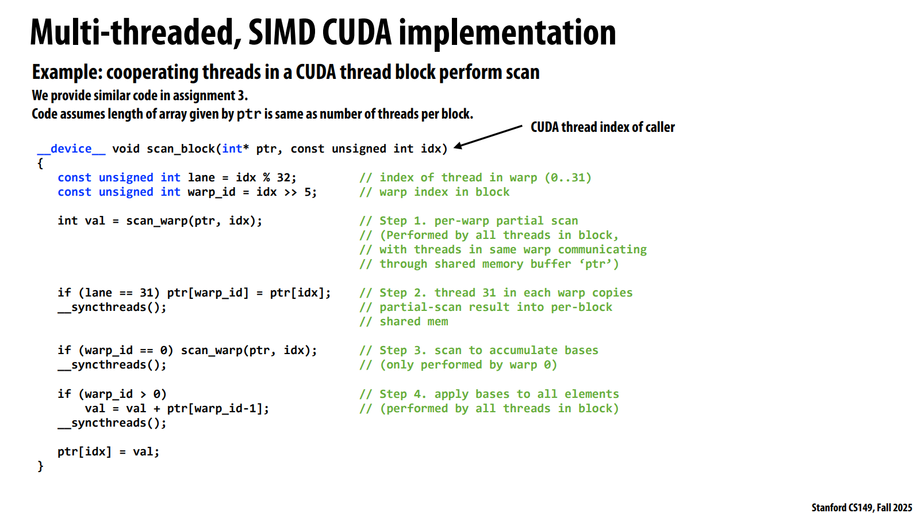

### 3.5 Segmented Scan

下面的例子非常直观地展示了这个"层次化的并行性"问题：

- **图论场景**：对于每个顶点 v，遍历 v 的每一条边 e。
- **粒子模拟**：对于每个粒子 p，遍历距离 p 在 D 以内的所有其他粒子。
- **文本处理**：对于集合中的每个文档 d，遍历 d 中的每一个单词。

这里面存在**两个层次的并行性**：一是不同顶点/粒子/文档之间可以并行处理（外层），二是每个顶点内部的边、每个粒子周围的邻域、每个文档内部的单词也可以并行处理（内层）。但问题在于，这些内层序列的长度**极不规则**——有的顶点可能连着上千条边，有的顶点可能只有一两条；有的文档洋洋洒洒，有的文档只有寥寥数语。

正是这种**不规则性**导致传统的简单并行策略（比如为每个外层元素分配一个线程）无法充分利用 SIMD 或 GPU 的大规模并行能力，因为不同线程的工作负载差异悬殊，会导致大量线程空转。

**分段扫描**就是将"扫描"这个操作推广到了这种嵌套结构上：它能够识别出每个子序列的边界（通过用"起始标志"标记），然后在一趟并行的 up-sweep 和 down-sweep 过程中，正确地在每个子序列内部独立完成累积运算，同时维持整体数据并行的工作模式。

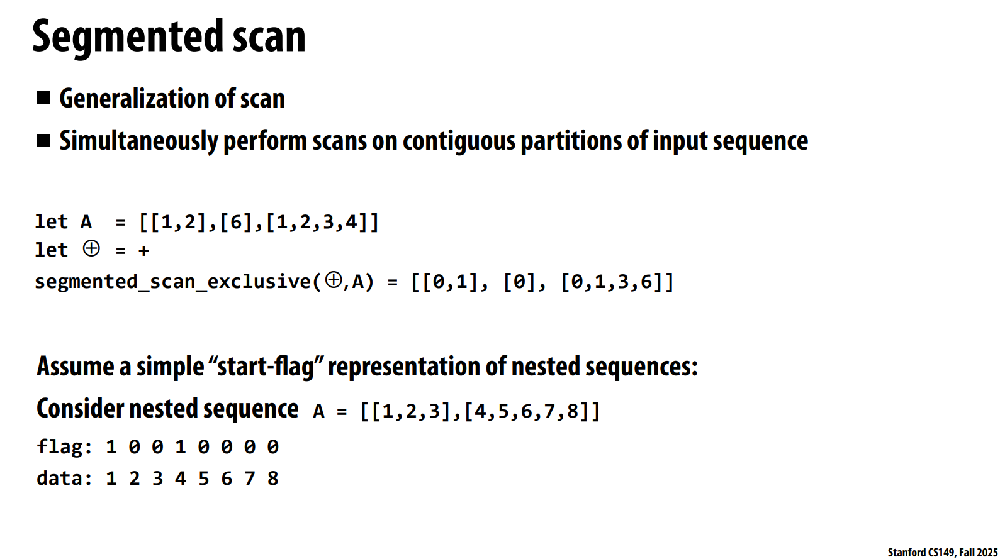

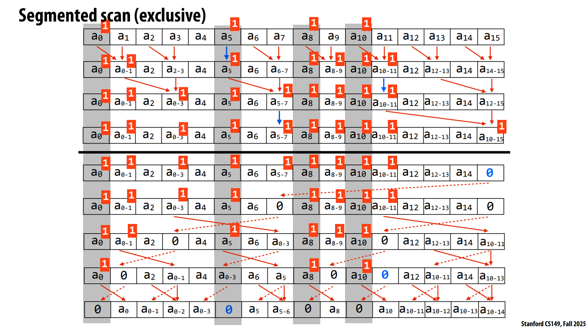

### 3.6 Gather/Scatter

**Gather**：给定一个索引序列，从输入序列中取出对应位置的元素，形成新的输出序列。

output[i] = input[index[i]]

**Scatter**：给定一个索引序列，将输入序列中的元素，放置到输出序列的对应位置。

output[index[i]] = input[i]

虽然 gather 让非连续访问变得可行，但它无法利用缓存行的空间局部性——每次加载可能命中完全不同的缓存行，导致大量的缓存缺失和内存带宽浪费，因此在高性能并行编程中，尽量将数据排列为连续布局、利用连续加载（coalesced access）​比依赖 gather 要高效得多。这也是为什么 CS149 课程中反复强调内存带宽往往比计算本身更容易成为瓶颈。

下面是一个例子，结合以上操作实现一个稀疏矩阵乘法。

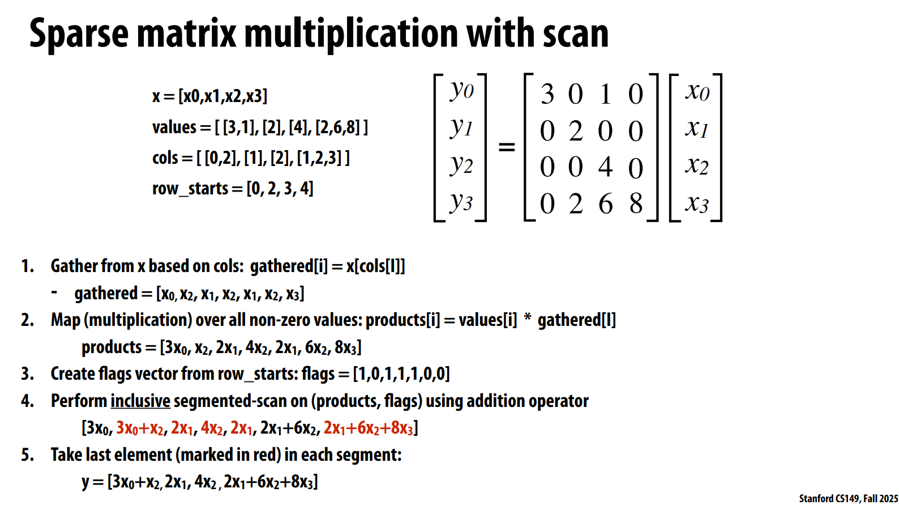
